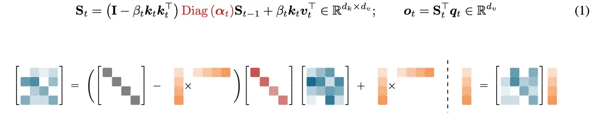
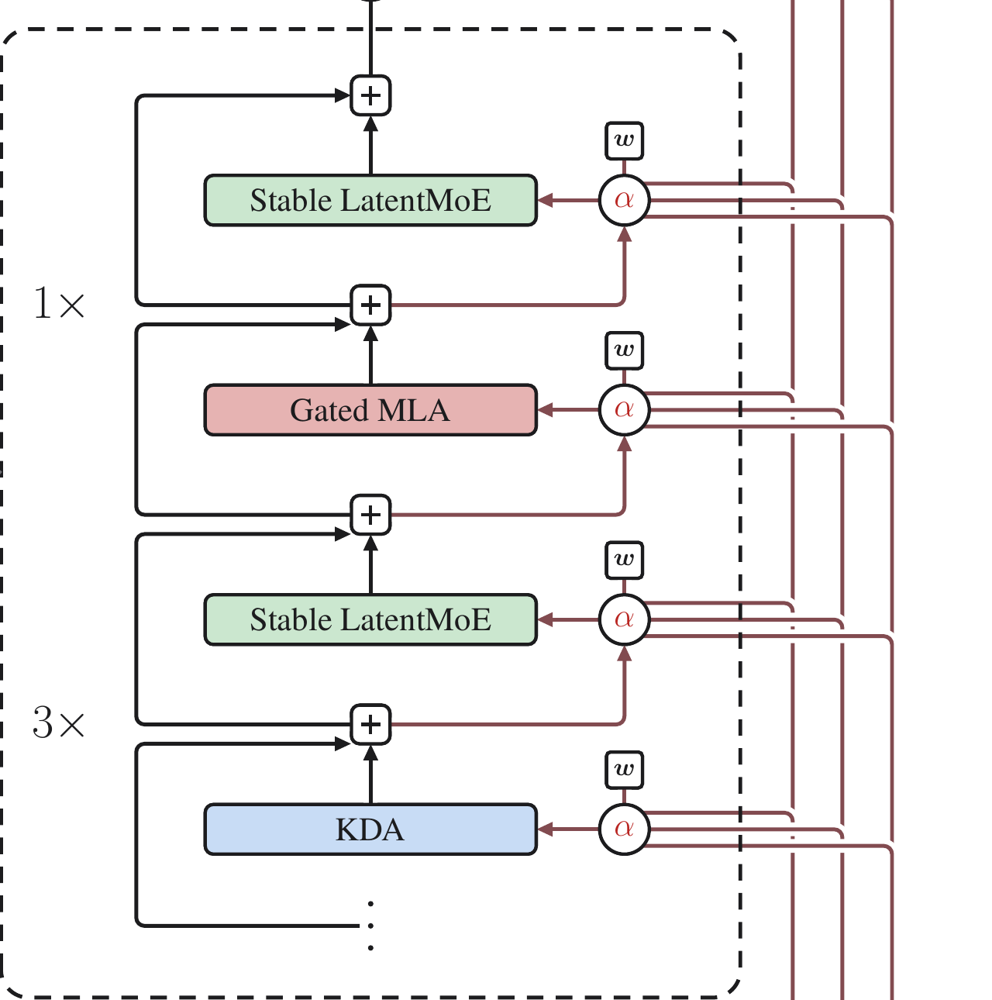
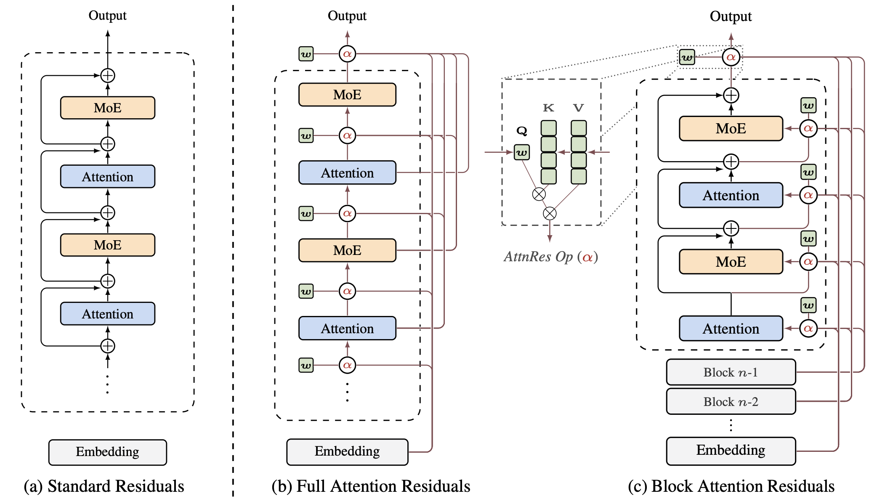
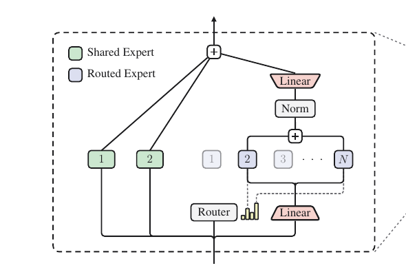
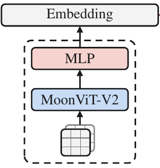

# GLM-5.2 与 Kimi K3：长上下文模型架构讲义

> GLM-5.2：@炯轩 · Kimi K3：@brian
>
> 配套演示：[GLM-5.2 & Kimi K3 HTML PPT](./glm5.2-visualization/index.html)

这份文档不是 PPT 的逐页文字版。PPT 负责建立直觉和控制分享节奏，讲义负责补足推导、设计边界与系统含义。

目标读者已经了解 Transformer、Attention、Residual 和 MoE，但不需要预先熟悉 MLA、DSA、KDA、AttnRes 或 LatentMoE。

整场分享只追一条主线：

> 上下文、网络深度和模型容量继续扩大以后，模型怎样保存信息、选择信息，并避免让每个 token 为全部历史和全部参数付费？

## 阅读地图

| 讲义部分 | 对应 PPT | 要回答的问题 |
|---|---|---|
| Attention 与 KV cache | Chapter 01–03 | 为什么长序列会把历史状态变成容量和带宽瓶颈？ |
| GLM-5.2 | Chapter 04–08 | MLA、DSA、IndexShare 分别压缩什么？ |
| Kimi K3 | Chapter 09–15 | K3 如何沿 token、depth、channel 三个方向扩展？ |
| 系统分析入口 | Chapter 16 | 架构变化最终会落成哪些计算、访存与通信对象？ |

---

# 第一部分：Attention 的成本从哪里来

## 1. 先把 token 轴与 feature 轴分清

设输入包含 `S` 个 token，每个 token 的 hidden size 是 `d_model`。可以把 hidden states 看成一个矩阵：

```text
X shape = [S, d_model]

纵轴：S 个 token
横轴：每个 token 的 feature
```

Attention 首先沿 feature 轴做三次线性投影：

```text
Q = X · W_Q
K = X · W_K
V = X · W_V
```

投影改变每行的 feature 表示，但不会合并 token。输入有 `S` 行，Q、K、V 仍然各有 `S` 行。

多头实现通常会把最后一个维度继续拆成 `heads × head_dim`：

```text
Q shape = [S, H_q, d_q]
K shape = [S, H_kv, d_k]
V shape = [S, H_kv, d_v]
```

后面讨论 MHA、GQA 和 MLA 时，最重要的不是记住符号，而是持续追踪两件事：

1. 历史中有多少行，也就是保存了多少 token；
2. 每一行有多宽，也就是每个 token 保存多少状态。

长上下文首先增加的是历史行数。MHA、GQA 与 MLA 的主要区别，则在于每一行保存什么、保存多宽。

### 对应 PPT

Chapter 01 用矩阵动画建立 token 轴与 feature 轴的直觉。本节给出后续所有 cache 讨论所依赖的 shape 语义。

---

## 2. 一行 Query 是怎样读取历史的

只看当前 token 的一行 query。它会和可见历史中的每一行 key 做点积：

```text
score_j = (q_t · k_j) / sqrt(d_h)
```

如果当前能看到 `S` 个历史 token，就会得到 `S` 个 score。Softmax 将它们变成一行归一化权重：

```text
p_t = softmax([score_1, score_2, ..., score_S])
```

这行权重回答的是：当前 query 应该从每个历史位置读取多少信息？

随后用同一组权重混合 Value：

```text
o_t = p_1 v_1 + p_2 v_2 + ... + p_S v_S
```

因此，Attention 可以拆成两个不同的动作：

1. `Q × Kᵀ` 决定从哪些 token 读取；
2. `attention weights × V` 决定把读到的内容怎样混合。

这个区分对理解 DSA 很重要。DSA 的 Indexer 负责先缩小候选 token 集合，真正的核心 Attention 仍会在候选集合中重新计算精确权重。

### 一个常见误解

Attention 权重的长度由历史 token 数决定，而不是由 embedding dimension 决定。Feature 维负责表示“一个 token 里有什么”，token 维负责表示“可以从哪些位置读取”。

### 对应 PPT

Chapter 02 用一行 Query 逐步展示 score、Softmax 和 Value 混合。讲解时应强调“选择位置”与“混合内容”是两个动作。

---

## 3. KV cache 省掉了重复计算，却没有省掉历史读取

自回归推理分为 Prefill 和 Decode。

Prefill 一次处理整段输入，可以并行计算输入 token 的 Q、K、V，同时把 K/V 写入 cache。

Decode 每一步只增加一个 token，因此只需要为当前 hidden state 计算新的 `q_t、k_t、v_t`：

```text
当前 hidden state
      ├── q_t：读取历史
      ├── k_t：追加到 K cache
      └── v_t：追加到 V cache
```

第 `t` 步的计算可以写成不会依赖 Markdown 数学插件的形式：

```text
scores_t = q_t · K[1:t]ᵀ / sqrt(d_h)
o_t      = softmax(scores_t) · V[1:t]
```

KV cache 的收益是：历史 token 的 K/V 不必在每个 Decode step 重新计算。

它没有消除两项随序列增长的成本：

- **容量：** 每增加一个 token，cache 就多一行历史状态；
- **读取：** 当前 query 仍要读取截至当前的历史 K/V。

用 `T` 表示上下文长度，标准 Attention 的 cache 容量可以粗略理解为：

```text
KV cache ∝ layers × T × KV heads × head_dim
```

这里没有列出 batch、数据类型等常数项，因为真正需要抓住的是 `T`：上下文翻倍时，逐 token cache 的容量也近似翻倍。

Decode 往往不是“算不动点积”，而是“需要反复把越来越长的历史状态搬到计算单元”。这也是为什么长上下文优化不能只看 FLOPs。

### Prefill 与 Decode 不能混为一谈

Prefill 拥有较大的序列并行度，矩阵乘法更容易利用计算单元；它首先暴露计算量和临时状态问题。

Decode 每步 token 数很少，历史却很长，容易暴露 HBM 读取、kernel launch、并行调度和跨设备通信问题。

一个架构声称降低复杂度，并不自动等于两个阶段都同比变快。后续讨论 MLA、DSA 和 KDA 时，都要分别问 Prefill 与 Decode 的实际数据流。

### 对应 PPT

Chapter 03 的重点不是重复 Attention 公式，而是建立“缓存避免重算，但历史仍需保存和读取”的系统直觉。

---

# 第二部分：GLM-5.2 如何压缩和选择历史

## 4. MHA、GQA、MLA 改变的是每个历史 token 保存什么

先把三种结构放进同一张坐标系。

| 结构 | Query heads | KV heads / 状态 | 历史 token 行数 |
|---|---|---|---|
| MHA | 多组 | 每个 Query head 对应独立 K/V | 随上下文增长 |
| GQA | 多组 | 多个 Query heads 共享 K/V | 随上下文增长 |
| MLA | 多组 | 每个 token 保存共享 latent 状态 | 随上下文增长 |

三者都保留逐 token 历史。它们优化的是每个 token 对应的状态宽度，而不是把历史 token 本身删掉。

### 4.1 MHA：复制多条独立 Attention 路径

MHA 让不同 head 在不同子空间中学习关系：

```text
Q₁, K₁, V₁ → Attention₁ → O₁
Q₂, K₂, V₂ → Attention₂ → O₂
Q₃, K₃, V₃ → Attention₃ → O₃
                         ↓
                    Concat + W_O
```

多条路径增强了表达能力，但历史中的每个 token 也要保留多组 head-specific K/V。

### 4.2 GQA：让多个 Query heads 共享 K/V

GQA 保留较多 Query heads，但减少 K/V heads：

```text
Q₁、Q₂ ──→ Shared KV A ──→ Attention₁、Attention₂
Q₃、Q₄ ──→ Shared KV B ──→ Attention₃、Attention₄
```

它减少的是 K/V 副本数量。当前 query 仍然访问对应的完整历史，cache 的 token 轴并没有改变。

### 4.3 MLA：把一组多头 K/V 压成共享 latent

MLA 不再为一个历史 token 常驻保存完整 multi-head K/V，而是先下投影为更窄的 latent：

```text
c_t_KV = W_DKV · h_t
```

需要显式恢复 K/V 时，可以再做上投影：

```text
k_t = W_UK · c_t_KV
v_t = W_UV · c_t_KV
```

同样是 `T` 个历史 token，cache 仍然有 `T` 行；变化在于每行由完整多头 K/V 变成更窄的 `c_t_KV`。

### 对应 PPT

Chapter 04–06 分别画出 MHA、GQA、MLA。讲义把三页合在一起，是为了突出它们沿同一条轴逐步压缩历史状态宽度。

---

## 5. MLA 为什么可以在 latent 上完成 Attention

MLA 不一定需要先恢复所有历史 token 的完整 K/V，再执行 Attention。

以 key 路径为例，原本的点积是：

```text
q_tᵀ · (W_UK · c_j_KV)
```

利用矩阵乘法结合律，可以改写为：

```text
(W_UKᵀ · q_t)ᵀ · c_j_KV
```

也就是说，可以先把 `W_UK` 吸收到 query 路径，再让变换后的 query 直接读取 latent cache。

Value 与输出投影也可以做类似重排。这样推理时不必为全部历史 token 物化完整 multi-head K/V。

这里依赖的是矩阵乘法的结合律，不是交换律。矩阵乘法一般不能交换顺序。

### RoPE 为什么需要单独处理

RoPE 会让 key 的变换依赖 token position。一个对所有 token 共享的固定矩阵可以被吸收到 query，但位置相关的旋转不能简单视为同一个固定上投影。

因此 MLA 通常将内容相关的低秩部分与位置相关的 RoPE 部分解耦。理解这点比背具体维度更重要：

```text
内容状态：适合压缩并缓存为 latent
位置状态：保留独立的 RoPE 表示
```

### MLA 到底省了什么

MLA 主要减少每个历史 token 常驻的状态宽度，以及 Decode 时需要从 HBM 读取的 K/V 字节数。

它没有把 token 轴从 `T` 变成常数。上下文继续增长时，latent cache 仍会继续增加。这个未解决的问题，正是 DSA 和 KDA 选择不同路线继续处理的地方。

### 常见误解

- MLA 不是丢掉多头 Attention；多头差异可以在 query、上投影和输出路径中恢复。
- MLA 不是将整个 hidden state 永久压成低维；压缩对象是 Attention 的历史 K/V 表示。
- MLA 不是稀疏 Attention；它改变状态表示，不决定当前 query 读取哪些 token。

---

## 6. DSA 将“找候选”与“精确读取”拆成两级

MLA 回答“历史状态以什么形式保存”。DeepSeek Sparse Attention 回答“当前 query 需要访问哪些历史位置”。

DSA 的基本数据流是：

```text
Current Query
     ↓
  Indexer ──→ 为历史位置打分
     ↓
   Top-K ──→ 产生候选 token positions
     ↓
  Gather ──→ 读取候选位置的 latent KV
     ↓
Sparse Core Attention
```

Indexer 是一个较轻的检索路径。它的任务不是直接产生最终 Attention 输出，而是高召回地找出可能重要的历史位置。

Top-K 将连续 score 变成离散 index。Gather 再根据 index 从历史状态中取出对应行。核心 Attention 最后在这些候选位置上重新计算精确权重。

### 为什么不能只说“Attention 变稀疏了”

“稀疏”只描述核心 Attention 的候选集合变小，却隐藏了前面的工作：

- Indexer 仍要对历史建立或计算可检索的分数；
- Top-K 需要选择位置；
- Gather 会产生不连续的历史读取；
- 稀疏后的 shape 还要适配高效 kernel。

因此 DSA 将一个大的 dense Attention 问题，重新安排成检索、选择、搬运和核心计算四个问题。

### Prefill 与 Decode 中的差异

Prefill 中有大量 query，可把 Indexer 和核心 Attention 组织成较大的并行任务，但 Top-K、索引生成和临时 buffer 可能很重。

Decode 中只有少量新 query，核心 Attention 读取的 token 数减少更直接；与此同时，不连续 Gather、索引访问和小任务调度可能变得突出。

是否更快取决于节省的 latent KV 读取，能否覆盖 Indexer、Top-K 与 Gather 的额外成本。

### 对应 PPT

Chapter 07 用流程图展示 DSA。讲解时应把“候选检索”和“候选内精确 Attention”明确分开。

---

## 7. IndexShare 复用的是位置选择，不是 Attention 结果

如果每一层都重新执行 Indexer，很多相邻层会重复做相似的历史检索。

IndexShare 的思路是周期性运行完整 Indexer，并让后续相邻层复用 Top-K positions：

```text
Full layer：Indexer → Top-K index → own Core Attention
                              │
Shared +1：reuse index ───────┴→ own Core Attention
Shared +2：reuse index ───────┴→ own Core Attention
Shared +3：reuse index ───────┴→ own Core Attention
```

被共享的是一组 token 位置。每个 shared layer 仍然拥有自己的 query、K/V 投影、Attention 权重和输出。

这是一种有意的近似：相邻层对“哪些历史位置值得看”的判断通常相近，因此无需每层都支付一次完整检索。

### 三个需要讲清的边界

1. IndexShare 不共享完整 Attention 输出；
2. IndexShare 不共享全部 KV cache；
3. IndexShare 也不是让相邻层拥有完全相同的 Attention 权重。

它只复用候选集合。候选集合内怎样读取，仍由当前层决定。

### 系统上的新对象

IndexShare 引入一个跨层 index buffer。它减少 Indexer 计算，却要求执行图能够正确管理 index 的生命周期、布局与层间复用。

在性能分析中，应分别测量 Full Indexer layer 与 Shared layer，不能把两者平均后再猜瓶颈。

---

## 8. GLM-5.2 的完整主线

GLM-5.2 将历史状态的压缩、选择和复用接在一条数据流中：

```text
Hidden states
      ↓
MLA：为每个 token 形成 latent KV
      ↓
Indexer：对历史位置打分
      ↓
Top-K + Gather：取出候选 latent KV
      ↓
Sparse Core Attention：候选内精确读取
      ↓
MoE：对当前 token 做稀疏 FFN 变换
```

这套设计不是由一个模块独立解决长上下文，而是三层分工：

- MLA 压缩每个历史 token 的状态宽度；
- DSA 减少核心 Attention 实际读取的历史行数；
- IndexShare 减少相邻层重复选择候选的成本。

可以用下面的反事实检查自己是否真正理解：

```text
只有 MLA：
  每行更窄，但仍然逐 token 保存并读取历史。

只有 DSA：
  核心 Attention 读得更少，但候选状态本身可能仍很宽。

没有 IndexShare：
  每一层都需要重新为全部历史做候选选择。
```

### 为什么讲义不罗列参数表

层数、专家数和 Top-K 是实现配置，不是架构逻辑。它们会影响成本，但不能替代对数据流的理解。

分享中更值得观众记住的是：GLM-5.2 将“存什么”“读哪些”“多久重新选择一次”拆成了三个独立控制点。

### 对应 PPT

Chapter 08 用一张总图收束 GLM-5.2。讲到这里，观众应该能够从图上指出 latent cache、index、Gather 和 Core Attention，而不是只记住 MLA/DSA 缩写。

---

# 第三部分：Kimi K3 沿三个方向重组信息流

## 9. 为什么要同时讨论 token、depth 与 channel

想象一个持续运行的 agent。它读取需求、浏览代码、调用工具、观察画面、定位错误，再继续修改。上下文不断增加，模型也需要更深的推理和更大的知识容量。

扩展会同时碰到三个问题：

| 方向 | 原始结构 | 扩展时的问题 |
|---|---|---|
| Token | Self Attention | 历史状态和读取流量随上下文增长 |
| Depth | Residual stream | 早期表示被混入累计状态，难以单独重读 |
| Channel / capacity | Dense FFN 或普通 MoE | 容量扩大带来更多权重读取、激活和通信 |

这里的 channel 不是“不同记忆通道拥有不同保留节奏”。它指同一个 token 在 feature / expert 维度上，可以进入不同的计算路径。

K3 分别给出三类回答：

```text
Token   → KDA + 周期性 Gated MLA
Depth   → Block Attention Residuals
Channel → Stable LatentMoE
```

三者共享同一种设计倾向：先把处处执行的完整 dense cost 变成状态、候选或路由，再按内容决定真正需要哪一部分。

### 对应 PPT

Chapter 09 只抛出三个扩展问题，Chapter 10 再给出三个架构答案。讲义从这里开始分别展开机制，不再重复 PPT 上的三行结论。

---

## 10. KDA：用固定状态替代逐 token KV 列表

Kimi Delta Attention 的核心变化，是不再为每个历史 token 追加一行 K/V，而是持续更新一个固定大小的 recurrent state。

对一个 head，可以写成：

```text
S_t = (I - β_t k_t k_tᵀ) · Diag(α_t) · S_(t-1)
      + β_t k_t v_tᵀ

o_t = S_tᵀ q_t

S_t shape = [d_k, d_v]
```

下面这张图来自论文公式的矩阵化表达：



公式看起来复杂，但可以按实际含义拆成“遗忘、预测、修正、读取”四步。

### 10.1 遗忘：先决定旧状态保留多少

先定义经过遗忘的旧状态：

```text
S_old = Diag(α_t) · S_(t-1)
```

`α_t` 是输入相关的 gate。它沿 key channel 调整旧状态，不要求所有方向以同样速度衰减。

这个动作解决普通 linear attention 只能不断累加的问题。没有遗忘时，早期写入会永久留在有限状态里，新旧信息容易相互干扰。

遗忘不等于把某个历史 token 精确删除。KDA 保存的是压缩后的关联状态，gate 控制的是状态方向，而不是原始 token 列表中的某一行。

### 10.2 Delta rule：先看旧状态会给出什么

旧状态在当前 key 方向上的预测是：

```text
predicted value = S_oldᵀ · k_t
```

当前 token 想写入的目标是 `v_t`。两者的差就是需要修正的部分：

```text
error = v_t - S_oldᵀ · k_t
```

状态更新可以等价地理解为：

```text
S_t = S_old + β_t k_t · errorᵀ
```

展开后就是前面的 KDA 公式。这个写法更容易看出“Delta”的含义：不是无条件再加一个 `k_t v_tᵀ`，而是只写入当前预测与目标之间的差。

如果旧状态已经能在 `k_t` 方向给出接近 `v_t` 的结果，更新就会较小。如果旧关联已经过时，误差项会沿该 key 方向覆盖或修正它。

### 10.3 写入：key 决定写到哪个方向，value 决定写什么

外积 `k_t · errorᵀ` 的 shape 是 `[d_k, d_v]`，恰好与状态矩阵相同。

可以把 `k_t` 理解为状态中的地址方向，把 value error 理解为需要写入的内容。这个类比只帮助理解矩阵更新，不代表状态里存在离散、可枚举的内存槽。

### 10.4 读取：query 直接查询更新后的状态

更新完成后：

```text
o_t = S_tᵀ · q_t
```

Query 不再与全部历史 key 做一遍点积，而是从压缩后的关联矩阵读取结果。

KDA 因此更接近“Attention 参数化的 recurrent memory”，而不是保存完整档案的标准 Attention。

---

## 11. KDA 为什么能省 KV cache，又付出了什么

标准 Attention 的 Decode 状态随 token 增长：

```text
token 1 → K₁, V₁
token 2 → K₂, V₂
...
token T → K_T, V_T

state size ∝ T
```

KDA 层始终只传递同样 shape 的状态矩阵：

```text
token 1 ──update──→ S₁
token 2 ──update──→ S₂
...
token T ──update──→ S_T

state size ∝ d_k × d_v
state size 与 T 无关
```

因此，无论上下文是 1K、128K 还是 1M token，KDA 层的 Decode 历史状态不会继续按 token 追加。

### “固定大小”不等于“无损”

逐 token KV cache 保留了历史位置的独立表示，未来 query 可以重新给任意位置分配权重。

KDA 将整个历史压进有限状态。它擅长持续维护可更新的关联，却不保证保留每个 token 的精确细节。

这是一种明确的交换：

```text
标准 Attention：
  更完整的历史访问能力
  ↔ 随上下文增长的容量与读取

KDA：
  固定大小的历史状态
  ↔ 有限状态带来的信息压缩
```

### Prefill 为什么仍然需要专门实现

KDA 的状态有时间依赖：

```text
S_t depends on S_(t-1)
```

如果逐 token 串行更新，Prefill 很难充分利用加速器。实际实现会把序列切成 chunk，在 chunk 内组织并行矩阵计算，在 chunk 之间传递状态。

```text
chunk 0 ──state──→ chunk 1 ──state──→ chunk 2
```

所以 KDA 的“线性状态”首先解决容量问题。Prefill 是否高效，还取决于 chunkwise algorithm、scan、数值稳定性和 kernel 实现。

### 三个不应说成的结论

- KDA 没有 cache：错误。它有 recurrent state，只是不逐 token 增长。
- KDA 记住全部历史：错误。它保存的是压缩状态。
- 线性 Attention 必然更快：错误。真实速度还取决于 state update 与硬件映射。

---

## 12. Hybrid Attention：工作状态与精确历史访问互补

如果 KDA 会压缩历史，模型怎样保留对具体 token 的精确关联？

K3 没有把所有 Attention 都替换为 KDA。论文中的 Hybrid block 采用三组 KDA，再接一组 Gated MLA：



```text
KDA + Stable LatentMoE
KDA + Stable LatentMoE
KDA + Stable LatentMoE
Gated MLA + Stable LatentMoE
```

KDA 高频更新固定状态，承担大部分序列建模。Gated MLA 周期性保留 token-to-token 的全局 Attention，补充精确历史关联。

“Gated” 不是指模型运行到一半决定要不要调用某层。Gated MLA 在网络中的位置是固定的，gate 是模块内部的内容控制。

### 为什么不是 KDA 与 Full Attention 二选一

纯 Full Attention 保留最完整的历史访问，却让每层都承担随上下文增长的状态与读取。

纯 recurrent state 最容易扩展长度，却会把所有历史压入固定容量。

Hybrid 的意义是让两种机制承担不同频率的工作：

```text
KDA：
  高频、固定状态、持续更新

Gated MLA：
  低频、逐 token 历史、精确全局关联
```

这比“一个负责推理、一个负责查询”的说法准确。两者都参与模型推理，只是历史表示和读取方式不同。

### 对应 PPT

Chapter 11 讲 KDA 状态更新，Chapter 12 用论文架构图说明 KDA 与 Gated MLA 的排布。两页应连在一起讲，不能把 KDA 描述成独立完整的 K3 序列模块。

---

## 13. AttnRes：让当前层重新选择早期表示

普通 residual block 可以简写为：

```text
h_l = h_(l-1) + F_l(h_(l-1))
```

每层输出继续进入同一条 residual stream。早期表示会被包含在累计结果中，但当前层无法把某个早期来源单独取出来重新组合。

问题不是“后面层一定没有贡献”，也不是简单的数值加一。更准确的描述是：所有来源经过固定加法混在一条流里，来源之间缺少内容相关的选择。

论文给出了 Standard、Full 和 Block Attention Residuals 的对比：



### 13.1 Full Attention Residuals

Full 版本保留 embedding 和此前各层的表示。当前 token 根据自身内容，对这些 depth sources 产生权重：

```text
r_l = Σ α_(l,i)(current token) · z_i
```

这里的 `α` 不是训练完成后固定不变的“第几层重要性”。它随当前 token 的表示变化，因此不同 token 可以选择不同深度的来源。

Self Attention 沿 token 轴选择历史位置；AttnRes 沿 depth 轴选择早期表示。两者形式相似，但候选集合所在的轴不同。

### 13.2 Block Attention Residuals

如果保存每一层输出，状态和读取成本会随深度增长。Block 版本在 block 内保留普通 residual，只在 block representations 之间做 depth attention。

```text
block 内：普通 residual
block 间：Attention Residual
```

这样候选来源从逐层变成逐 block，保留了跨深度重读能力，同时控制需要保存和访问的中间表示数量。

### 13.3 它解决的不是长序列 KV cache

AttnRes 操作的是网络深度上的中间表示，不会替代 token 轴上的 KDA 或 MLA。

它新增的系统对象也不同：需要保存的是 block representations，并在后续 block 中读取和加权，而不是保存更长的 token KV 列表。

### 对应 PPT

Chapter 13 应直接使用论文总图。讲解顺序是 Standard Residual → Full AttnRes → Block AttnRes，不必先把所有符号解释完。

---

## 14. Stable LatentMoE：把专家 payload 放进更窄的空间

MoE 的基本价值是：模型可以拥有大量专家参数，但每个 token 只激活少量专家。

当模型继续扩容时，成本不只来自 Expert GEMM。Serving 还需要读取被激活专家的权重，并在 Expert Parallel 中把 token activation 发送到对应设备。

普通 routed expert 接收 full-width hidden state。Top-K 增大时，专家权重读取和 All-to-All payload 都会增长。

LatentMoE 的切入点是：不要把整个模型 hidden size 变窄，只把 routed expert 的 payload 压到 latent space。



### 14.1 Router 与压缩分支的正确顺序

Router 和下投影都直接读取 full-width `x`，两条分支并行：

```text
Router branch：
x[d] → Router → Top-K expert indices + weights

Routed payload branch：
x[d] → W_down → z[latent] → dispatch → selected experts
```

因此不能画成：

```text
x → W_down → Router
```

Router 需要完整表示来判断专家选择。被压缩的是发往 routed experts 的 activation，不是 Router 的观察范围。

### 14.2 Routed path 的完整数据流

```text
x[d]
  ↓ W_down
z[latent]
  ↓ dispatch by Top-K indices
routed experts
  ↓ weighted combine
RMSNorm
  ↓ W_up
routed output[d]
```

跨设备传输并进入 routed experts 的主要 payload 是 `z[latent]`。专家主要权重矩阵也在 latent 维工作，因此能减少权重读取、激活计算和通信字节。

省下来的预算可以用来增加专家组合，而不要求每个 token 搬运同样多的 full-width activation。

### 14.3 Shared path 保持 full-width

Shared experts 直接处理 `x[d]`，承担所有 token 都需要的公共变换：

```text
x[d] → shared experts → shared output[d]
```

最后 routed output 与 shared output 在主干宽度上相加。

所以 LatentMoE 不是把所有 FFN 计算压缩。它只压缩稀疏 routed path，把公共能力和专家专长放在不同宽度上处理。

### 14.4 “Stable” 解决什么

专家数量和稀疏度继续增大后，训练会更容易暴露输出尺度和极端 activation 问题。

K3 在 routed aggregate 后使用 RMSNorm 控制尺度，并使用更稳定的门控激活设计。它们服务于大规模稀疏训练，不改变 Router 与 latent payload 的先后关系。

Quantile Balancing 是训练期间更新 Router selection bias 的负载均衡方法。它不属于推理数据流，也不保证任意一个推理 batch 都完全均匀，因此不作为本次架构主线展开。

### 三个边界

- Router 看 full-width 输入，不能说“先压缩再路由”。
- LatentMoE 省的是 routed path，不是把 shared path 一起缩窄。
- MoE 稀疏不代表系统没有代价；routing、dispatch/combine、权重 streaming 与 All-to-All 仍需优化。

### 对应 PPT

Chapter 14 应沿着 Router、Routed、Shared 三条线讲。观众只要能说清 Router 在压缩前读取什么、真正跨设备传输什么，就掌握了核心。

---

## 15. Native Vision：创新主要发生在训练方式

推理时，K3 的视觉数据流仍与常见 VLM 相似：

```text
图片 / 视频
    ↓
MoonViT-V2
    ↓
MLP projector
    ↓
visual embeddings
    ↓
插入 text embedding sequence
    ↓
K3 backbone 自回归推理
```

Vision encoder 负责把像素变成视觉特征，projector 将特征映射到语言模型能接受的表示空间。视觉表示随后与文本 embedding 一起进入 K3 backbone。



K3 的“Native”重点不在推理接口，而在预训练方式。

### 15.1 单一 next-token loss

视觉和文字共同构成上下文，模型仍预测下一个文本 token。训练只有一份 next-token loss，而不是给视觉模块单独设计另一套主目标。

这份 loss 会同时约束语言输出和生成这些输出所依赖的视觉表示。

### 15.2 端到端联合训练

Loss 的梯度会经过 K3 backbone、MLP projector，继续回传到 MoonViT-V2。

这不是冻结 text model 后只训练 ViT 或 adapter。视觉编码器、projector 和文本 backbone 从预训练阶段共同适配同一个生成目标。

### 15.3 MoonViT-V2 从头训练

MoonViT-V2 不依赖一个预先完成对比学习的视觉编码器再接入语言模型，而是在联合训练中从头形成适合 OCR、文字和细粒度结构理解的视觉表示。

因此，Native Vision 与传统“先训练视觉塔，再冻结或局部微调接入 LLM”的主要区别，是优化目标和训练边界，而不是推理时突然取消 ViT。

### 需要保留的边界

- 图像输入仍有独立的 vision encoder 和 projector；
- “统一”指联合目标与语言主干，不代表图片 patch 和文本 token 在输入端完全相同；
- Native Vision 不会改变自回归输出仍是 next-token prediction 的事实。

### 对应 PPT

Chapter 15 应把“单一 next-token loss、端到端、从头训练”作为三个完整中文结论，再用下方路径图区分训练创新与推理流程。

---

# 第四部分：从架构图走向系统分析

## 16. 架构没有消灭成本，而是重新安排成本

GLM-5.2 与 Kimi K3 都没有让成本凭空消失。它们把完整 dense cost 重组为更明确的状态、选择与路由对象。

| 模型 | 架构机制 | 系统真正执行的对象 |
|---|---|---|
| GLM-5.2 | MLA | latent KV cache 与吸收后的投影 |
| GLM-5.2 | DSA | Indexer、Top-K、index、Gather |
| GLM-5.2 | IndexShare | 跨层 index buffer 与两类 layer |
| Kimi K3 | KDA | recurrent state update 与 chunk scan |
| Kimi K3 | AttnRes | block representation 保存与读取 |
| Kimi K3 | LatentMoE | routing、latent dispatch、Expert GEMM、All-to-All |
| Kimi K3 | Native Vision | 视觉 token、projector 与统一 backbone |

### 16.1 Prefill 要问什么

Prefill 处理长输入，首先要问：

- 长序列计算能否组织成足够大的矩阵任务；
- KDA 的 chunk scan 怎样跨 chunk 传播状态；
- DSA 的 Indexer、Top-K 与 Gather 使用多少临时状态；
- 视觉 token 会把有效序列长度增加多少；
- MoE dispatch 后每个 expert 的 token shape 是否适合高效 GEMM。

### 16.2 Decode 要问什么

Decode 每步并行度较低，首先要问：

- 每个新 token 需要从 HBM 读取多少 cache 或 recurrent state；
- DSA 减少的 KV 读取能否覆盖 Indexer 与 Gather；
- Expert 权重是否需要频繁 streaming；
- All-to-All payload 与同步延迟是多少；
- 小 shape kernel 的 launch 与调度成本是否占主导。

### 16.3 Roofline 不能只放一个 FLOPs 数字

硬件 Roofline 分析至少需要区分三类流量：

```text
计算：Attention、state update、Expert GEMM
HBM：KV/state、权重、临时 buffer
通信：dispatch/combine、collective、跨芯片状态传递
```

一个模块 FLOPs 下降，却可能因为访问更不连续而仍然受带宽限制。反过来，增加投影 FLOPs 也可能换来更少的 HBM 或通信字节。

所以后续硬件部分不应问“哪个架构复杂度更低”，而应问：

> 在具体 batch、序列长度、并行策略和拓扑下，每个 token 实际移动了多少数据，执行了哪些 kernel，关键路径在哪里？

### 对应 PPT

Chapter 16 只负责从架构过渡到 Prefill/Decode、TPU Roofline 与 MoE 优化。这里列出的系统对象，就是后续分享需要逐项测量的清单。

---

# 总结

GLM-5.2 的主线是：

> MLA 压缩每个历史 token 的状态宽度，DSA 选择核心 Attention 真正读取的位置，IndexShare 减少相邻层重复选择。

Kimi K3 的主线是：

> KDA 与 Gated MLA 共同处理长序列，AttnRes 让当前层沿网络深度选择表示，LatentMoE 把 routed expert payload 放进低维空间，Native Vision 用统一生成目标联合训练视觉与文本。

两条路线共同提醒我们：模型架构的价值不只在参数和复杂度符号，而在它怎样安排状态、读取、选择和通信。

听完架构部分后，观众应该能够回答四个问题：

1. 这个模块压缩的是 token 数、每个 token 的状态宽度，还是 expert payload？
2. 它保留了哪些精确信息，又用什么近似换取扩展性？
3. Prefill 和 Decode 中分别新增了哪些计算或状态？
4. 这些对象最终受算力、HBM 带宽还是互联通信限制？

---

# References

- [GLM-5.2 官方介绍](https://z.ai/blog/glm-5.2)
- [Kimi K3 Technical Report](https://arxiv.org/abs/2607.24653)
- [Kimi Linear](https://arxiv.org/abs/2510.26692)
- [Attention Residuals](https://arxiv.org/abs/2603.15031)
- [Attention Residuals GitHub](https://github.com/MoonshotAI/Attention-Residuals)
- [LatentMoE](https://arxiv.org/abs/2601.18089)
- [NVIDIA LatentMoE Project](https://research.nvidia.com/labs/nemotron/LatentMoE/)
