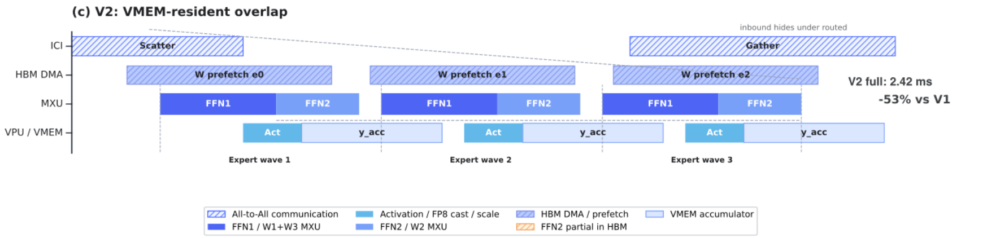
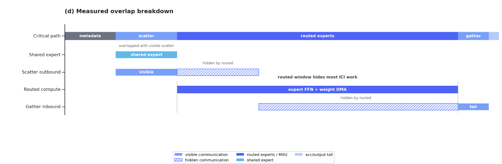

# GLM-5.2 与 Kimi K3：长上下文模型架构讲义

> GLM-5.2：@炯轩 · Kimi K3：@brian
>
> 在线演示：[GitHub Pages](https://primatrix.github.io/lectures/kimi-glm/architecture/)
>
> 本地文件：[GLM-5.2 & Kimi K3 HTML PPT](./glm5.2-visualization/index.html)

这份文档不是 PPT 的逐页文字版。PPT 负责建立直觉和控制分享节奏，讲义负责补足推导、设计边界与系统含义。

目标读者已经了解 Transformer、Attention、Residual 和 MoE，但不需要预先熟悉 MLA、DSA、KDA、AttnRes 或 LatentMoE。

整场分享只追一条主线：

> 上下文、网络深度和模型容量继续扩大以后，模型怎样保存信息、选择信息，并避免让每个 token 为全部历史和全部参数付费？

## 阅读地图

| 讲义部分 | 对应 PPT | 要回答的问题 |
|---|---|---|
| Attention 与 KV cache | Chapter 01–03 | 为什么长序列会把历史状态变成容量和带宽瓶颈？ |
| GLM-5.2 | Chapter 04–08 | MLA、DSA、IndexShare 分别压缩什么？ |
| Kimi K3 | Chapter 09–17 | K3 如何沿 token、depth、channel 三个方向扩展？ |
| 系统分析入口 | Chapter 18 | 架构变化最终会落成哪些计算、访存与通信对象？ |
| TPU 与 Prefill / Decode 性能 | Chapter 19–27 | TPU v7x 的算力、HBM、ICI 基线是什么？Roofline、长上下文 KV、DSA、MTP 与 MoE 如何改变计算强度？ |

---

# 第一部分：Attention 的成本从哪里来

## 1. 先把 token 轴与 feature 轴分清

设输入包含 `S` 个 token，每个 token 的 hidden size 是 `d_model`。可以把 hidden states 看成一个矩阵：

```text
X shape = [S, d_model]

纵轴：S 个 token
横轴：每个 token 的 feature
```

Attention 首先沿 feature 轴做三次线性投影：

```text
Q = X · W_Q
K = X · W_K
V = X · W_V
```

投影改变每行的 feature 表示，但不会合并 token。输入有 `S` 行，Q、K、V 仍然各有 `S` 行。

多头实现通常会把最后一个维度继续拆成 `heads × head_dim`：

```text
Q shape = [S, H_q, d_q]
K shape = [S, H_kv, d_k]
V shape = [S, H_kv, d_v]
```

后面讨论 MHA、GQA 和 MLA 时，最重要的不是记住符号，而是持续追踪两件事：

1. 历史中有多少行，也就是保存了多少 token；
2. 每一行有多宽，也就是每个 token 保存多少状态。

长上下文首先增加的是历史行数。MHA、GQA 与 MLA 的主要区别，则在于每一行保存什么、保存多宽。

### 对应 PPT

Chapter 01 用矩阵动画建立 token 轴与 feature 轴的直觉。本节给出后续所有 cache 讨论所依赖的 shape 语义。

---

## 2. 一行 Query 是怎样读取历史的

只看当前 token 的一行 query。它会和可见历史中的每一行 key 做点积：

```text
score_j = (q_t · k_j) / sqrt(d_h)
```

如果当前能看到 `S` 个历史 token，就会得到 `S` 个 score。Softmax 将它们变成一行归一化权重：

```text
p_t = softmax([score_1, score_2, ..., score_S])
```

这行权重回答的是：当前 query 应该从每个历史位置读取多少信息？

随后用同一组权重混合 Value：

```text
o_t = p_1 v_1 + p_2 v_2 + ... + p_S v_S
```

因此，Attention 可以拆成两个不同的动作：

1. `Q × Kᵀ` 决定从哪些 token 读取；
2. `attention weights × V` 决定把读到的内容怎样混合。

这个区分对理解 DSA 很重要。DSA 的 Indexer 负责先缩小候选 token 集合，真正的核心 Attention 仍会在候选集合中重新计算精确权重。

### 一个常见误解

Attention 权重的长度由历史 token 数决定，而不是由 embedding dimension 决定。Feature 维负责表示“一个 token 里有什么”，token 维负责表示“可以从哪些位置读取”。

### 对应 PPT

Chapter 02 用一行 Query 逐步展示 score、Softmax 和 Value 混合。讲解时应强调“选择位置”与“混合内容”是两个动作。

---

## 3. KV cache 省掉了重复计算，却没有省掉历史读取

自回归推理分为 Prefill 和 Decode。

Prefill 一次处理整段输入，可以并行计算输入 token 的 Q、K、V，同时把 K/V 写入 cache。

Decode 每一步只增加一个 token，因此只需要为当前 hidden state 计算新的 `q_t、k_t、v_t`：

```text
当前 hidden state
      ├── q_t：读取历史
      ├── k_t：追加到 K cache
      └── v_t：追加到 V cache
```

第 `t` 步的计算可以写成不会依赖 Markdown 数学插件的形式：

```text
scores_t = q_t · K[1:t]ᵀ / sqrt(d_h)
o_t      = softmax(scores_t) · V[1:t]
```

KV cache 的收益是：历史 token 的 K/V 不必在每个 Decode step 重新计算。

它没有消除两项随序列增长的成本：

- **容量：** 每增加一个 token，cache 就多一行历史状态；
- **读取：** 当前 query 仍要读取截至当前的历史 K/V。

用 `T` 表示上下文长度，标准 Attention 的 cache 容量可以粗略理解为：

```text
KV cache ∝ layers × T × KV heads × head_dim
```

这里没有列出 batch、数据类型等常数项，因为真正需要抓住的是 `T`：上下文翻倍时，逐 token cache 的容量也近似翻倍。

Decode 往往不是“算不动点积”，而是“需要反复把越来越长的历史状态搬到计算单元”。这也是为什么长上下文优化不能只看 FLOPs。

### Prefill 与 Decode 不能混为一谈

Prefill 拥有较大的序列并行度，矩阵乘法更容易利用计算单元；它首先暴露计算量和临时状态问题。

Decode 每步 token 数很少，历史却很长，容易暴露 HBM 读取、kernel launch、并行调度和跨设备通信问题。

一个架构声称降低复杂度，并不自动等于两个阶段都同比变快。后续讨论 MLA、DSA 和 KDA 时，都要分别问 Prefill 与 Decode 的实际数据流。

### 对应 PPT

Chapter 03 的重点不是重复 Attention 公式，而是建立“缓存避免重算，但历史仍需保存和读取”的系统直觉。

---

# 第二部分：GLM-5.2 如何压缩和选择历史

## 4. MHA、GQA、MLA 改变的是每个历史 token 保存什么

先把三种结构放进同一张坐标系。

| 结构 | Query heads | KV heads / 状态 | 历史 token 行数 |
|---|---|---|---|
| MHA | 多组 | 每个 Query head 对应独立 K/V | 随上下文增长 |
| GQA | 多组 | 多个 Query heads 共享 K/V | 随上下文增长 |
| MLA | 多组 | 每个 token 保存共享 latent 状态 | 随上下文增长 |

三者都保留逐 token 历史。它们优化的是每个 token 对应的状态宽度，而不是把历史 token 本身删掉。

### 4.1 MHA：复制多条独立 Attention 路径

MHA 让不同 head 在不同子空间中学习关系：

```text
Q₁, K₁, V₁ → Attention₁ → O₁
Q₂, K₂, V₂ → Attention₂ → O₂
Q₃, K₃, V₃ → Attention₃ → O₃
                         ↓
                    Concat + W_O
```

多条路径增强了表达能力，但历史中的每个 token 也要保留多组 head-specific K/V。

### 4.2 GQA：让多个 Query heads 共享 K/V

GQA 保留较多 Query heads，但减少 K/V heads：

```text
Q₁、Q₂ ──→ Shared KV A ──→ Attention₁、Attention₂
Q₃、Q₄ ──→ Shared KV B ──→ Attention₃、Attention₄
```

它减少的是 K/V 副本数量。当前 query 仍然访问对应的完整历史，cache 的 token 轴并没有改变。

### 4.3 MLA：把一组多头 K/V 压成共享 latent

MLA 不再为一个历史 token 常驻保存完整 multi-head K/V，而是先下投影为更窄的 latent：

```text
c_t_KV = W_DKV · h_t
```

需要显式恢复 K/V 时，可以再做上投影：

```text
k_t = W_UK · c_t_KV
v_t = W_UV · c_t_KV
```

同样是 `T` 个历史 token，cache 仍然有 `T` 行；变化在于每行由完整多头 K/V 变成更窄的 `c_t_KV`。

### 对应 PPT

Chapter 04–06 分别画出 MHA、GQA、MLA。讲义把三页合在一起，是为了突出它们沿同一条轴逐步压缩历史状态宽度。

---

## 5. MLA 为什么可以在 latent 上完成 Attention

MLA 不一定需要先恢复所有历史 token 的完整 K/V，再执行 Attention。

以 key 路径为例，原本的点积是：

```text
q_tᵀ · (W_UK · c_j_KV)
```

利用矩阵乘法结合律，可以改写为：

```text
(W_UKᵀ · q_t)ᵀ · c_j_KV
```

也就是说，可以先把 `W_UK` 吸收到 query 路径，再让变换后的 query 直接读取 latent cache。

Value 与输出投影也可以做类似重排。这样推理时不必为全部历史 token 物化完整 multi-head K/V。

这里依赖的是矩阵乘法的结合律，不是交换律。矩阵乘法一般不能交换顺序。

### RoPE 为什么需要单独处理

RoPE 会让 key 的变换依赖 token position。一个对所有 token 共享的固定矩阵可以被吸收到 query，但位置相关的旋转不能简单视为同一个固定上投影。

因此 MLA 通常将内容相关的低秩部分与位置相关的 RoPE 部分解耦。理解这点比背具体维度更重要：

```text
内容状态：适合压缩并缓存为 latent
位置状态：保留独立的 RoPE 表示
```

### MLA 到底省了什么

MLA 主要减少每个历史 token 常驻的状态宽度，以及 Decode 时需要从 HBM 读取的 K/V 字节数。

它没有把 token 轴从 `T` 变成常数。上下文继续增长时，latent cache 仍会继续增加。这个未解决的问题，正是 DSA 和 KDA 选择不同路线继续处理的地方。

### 常见误解

- MLA 不是丢掉多头 Attention；多头差异可以在 query、上投影和输出路径中恢复。
- MLA 不是将整个 hidden state 永久压成低维；压缩对象是 Attention 的历史 K/V 表示。
- MLA 不是稀疏 Attention；它改变状态表示，不决定当前 query 读取哪些 token。

---

## 6. DSA 将“找候选”与“精确读取”拆成两级

MLA 回答“历史状态以什么形式保存”。DeepSeek Sparse Attention 回答“当前 query 需要访问哪些历史位置”。

DSA 的基本数据流是：

```text
Current Query
     ↓
  Indexer ──→ 为历史位置打分
     ↓
   Top-K ──→ 产生候选 token positions
     ↓
  Gather ──→ 读取候选位置的 latent KV
     ↓
Sparse Core Attention
```

Indexer 是一个较轻的检索路径。它的任务不是直接产生最终 Attention 输出，而是高召回地找出可能重要的历史位置。

Top-K 将连续 score 变成离散 index。Gather 再根据 index 从历史状态中取出对应行。核心 Attention 最后在这些候选位置上重新计算精确权重。

### 为什么不能只说“Attention 变稀疏了”

“稀疏”只描述核心 Attention 的候选集合变小，却隐藏了前面的工作：

- Indexer 仍要对历史建立或计算可检索的分数；
- Top-K 需要选择位置；
- Gather 会产生不连续的历史读取；
- 稀疏后的 shape 还要适配高效 kernel。

因此 DSA 将一个大的 dense Attention 问题，重新安排成检索、选择、搬运和核心计算四个问题。

### Prefill 与 Decode 中的差异

Prefill 中有大量 query，可把 Indexer 和核心 Attention 组织成较大的并行任务，但 Top-K、索引生成和临时 buffer 可能很重。

Decode 中只有少量新 query，核心 Attention 读取的 token 数减少更直接；与此同时，不连续 Gather、索引访问和小任务调度可能变得突出。

是否更快取决于节省的 latent KV 读取，能否覆盖 Indexer、Top-K 与 Gather 的额外成本。

### 对应 PPT

Chapter 07 用流程图展示 DSA。讲解时应把“候选检索”和“候选内精确 Attention”明确分开。

---

## 7. IndexShare 复用的是位置选择，不是 Attention 结果

如果每一层都重新执行 Indexer，很多相邻层会重复做相似的历史检索。

IndexShare 的思路是周期性运行完整 Indexer，并让后续相邻层复用 Top-K positions：

```text
Full layer：Indexer → Top-K index → own Core Attention
                              │
Shared +1：reuse index ───────┴→ own Core Attention
Shared +2：reuse index ───────┴→ own Core Attention
Shared +3：reuse index ───────┴→ own Core Attention
```

被共享的是一组 token 位置。每个 shared layer 仍然拥有自己的 query、K/V 投影、Attention 权重和输出。

这是一种有意的近似：相邻层对“哪些历史位置值得看”的判断通常相近，因此无需每层都支付一次完整检索。

### 三个需要讲清的边界

1. IndexShare 不共享完整 Attention 输出；
2. IndexShare 不共享全部 KV cache；
3. IndexShare 也不是让相邻层拥有完全相同的 Attention 权重。

它只复用候选集合。候选集合内怎样读取，仍由当前层决定。

### 系统上的新对象

IndexShare 引入一个跨层 index buffer。它减少 Indexer 计算，却要求执行图能够正确管理 index 的生命周期、布局与层间复用。

在性能分析中，应分别测量 Full Indexer layer 与 Shared layer，不能把两者平均后再猜瓶颈。

---

## 8. GLM-5.2 的完整主线

GLM-5.2 将历史状态的压缩、选择和复用接在一条数据流中：

```text
Hidden states
      ↓
MLA：为每个 token 形成 latent KV
      ↓
Indexer：对历史位置打分
      ↓
Top-K + Gather：取出候选 latent KV
      ↓
Sparse Core Attention：候选内精确读取
      ↓
MoE：对当前 token 做稀疏 FFN 变换
```

这套设计不是由一个模块独立解决长上下文，而是三层分工：

- MLA 压缩每个历史 token 的状态宽度；
- DSA 减少核心 Attention 实际读取的历史行数；
- IndexShare 减少相邻层重复选择候选的成本。

可以用下面的反事实检查自己是否真正理解：

```text
只有 MLA：
  每行更窄，但仍然逐 token 保存并读取历史。

只有 DSA：
  核心 Attention 读得更少，但候选状态本身可能仍很宽。

没有 IndexShare：
  每一层都需要重新为全部历史做候选选择。
```

### 为什么讲义不罗列参数表

层数、专家数和 Top-K 是实现配置，不是架构逻辑。它们会影响成本，但不能替代对数据流的理解。

分享中更值得观众记住的是：GLM-5.2 将“存什么”“读哪些”“多久重新选择一次”拆成了三个独立控制点。

### 对应 PPT

Chapter 08 用一张总图收束 GLM-5.2。讲到这里，观众应该能够从图上指出 latent cache、index、Gather 和 Core Attention，而不是只记住 MLA/DSA 缩写。

---

# 第三部分：Kimi K3 沿三个方向扩展信息流

## 9. 模型变大时，信息流为什么也需要扩展

Kimi K3 对架构问题的定义不是“1M agent trace 会卡在哪里”，也不能从 KDA、AttnRes 和 LatentMoE 的实现反向拼出三个问题。应该先从 Scaling Laws 的视角观察标准 Transformer：当 sequence length、network depth 与 model width 分别增长时，什么状态、表示或计算代价会随之恶化？

> 模型扩展时，information flow 也要能沿 sequence length、network depth 与 model width 三个互补维度扩展，但每个维度首先暴露的是不同的 scaling problem。

这三个维度的起点分别是：

| 扩展维度 | 标准结构随 Scale 放大的问题 | K3 的机制 |
|---|---|---|
| Sequence length | 上下文长度 `L` 增长时，逐 token KV Cache 容量随 `L` 线性增长；Decode 每步读取的历史也更长，HBM 容量、带宽与延迟一起承压 | Hybrid Attention：每个 block 组合 3 层 KDA 与 1 层 Gated MLA |
| Network depth | 层数 `D` 增长时，PreNorm residual 以固定单位权重累加所有层输出，造成 hidden-state magnitude 持续增长，并逐步稀释每一层的相对贡献 | Attention Residuals |
| Model width | 模型宽度或容量增长时，如果仍然 Dense 激活，每个 token 的 FLOPs、activation、权重读取和跨卡通信都会同步增加 | Stable LatentMoE：每个 token 激活 16 / 896 routed experts |

这里的 channel 不是“不同记忆通道拥有不同保留节奏”。它指同一个 token 在 feature / expert 维度上的稀疏计算路径。

因此，K3 的整体对应关系是：

```text
Sequence length → Hybrid Attention（3 × KDA + 1 × Gated MLA）
Network depth   → Attention Residuals
Model width     → Stable LatentMoE
```

这三种机制互补，不能互相替代。Hybrid Attention 解决的是跨 token 的长上下文信息混合，AttnRes 扩展跨网络深度的 representation access，Stable LatentMoE 扩展跨专家通道的稀疏信息混合。它们共同组成 K3 backbone 的 information-flow 设计。

### 对应 PPT

Chapter 09 用同一页完成“问题 → 答案”：初始画面只呈现 sequence、depth、width 三个扩展问题；按一次右键，同时出现 Hybrid Attention、Attention Residuals 与 Stable LatentMoE。后续章节再分别展开三种机制。

---

## 10. KDA：用固定状态替代逐 token KV 列表

Kimi Delta Attention 的核心变化，是不再为每个历史 token 追加一行 K/V，而是持续更新一个固定大小的 recurrent state。

对一个 head，可以写成：

```text
S_t = (I - β_t k_t k_tᵀ) · Diag(α_t) · S_(t-1)
      + β_t k_t v_tᵀ

o_t = S_tᵀ q_t

S_t shape = [d_k, d_v]
```

下面这张图来自论文公式的矩阵化表达：


公式看起来复杂，但可以按实际含义拆成“遗忘、预测、修正、读取”四步。

### 10.1 遗忘：先决定旧状态保留多少

先定义经过遗忘的旧状态：

```text
S_old = Diag(α_t) · S_(t-1)
```

`α_t` 是输入相关的 gate。它沿 key channel 调整旧状态，不要求所有方向以同样速度衰减。

这个动作解决普通 linear attention 只能不断累加的问题。没有遗忘时，早期写入会永久留在有限状态里，新旧信息容易相互干扰。

遗忘不等于把某个历史 token 精确删除。KDA 保存的是压缩后的关联状态，gate 控制的是状态方向，而不是原始 token 列表中的某一行。

### 10.2 Delta rule：先看旧状态会给出什么

旧状态在当前 key 方向上的预测是：

```text
predicted value = S_oldᵀ · k_t
```

当前 token 想写入的目标是 `v_t`。两者的差就是需要修正的部分：

```text
error = v_t - S_oldᵀ · k_t
```

状态更新可以等价地理解为：

```text
S_t = S_old + β_t k_t · errorᵀ
```

展开后就是前面的 KDA 公式。这个写法更容易看出“Delta”的含义：不是无条件再加一个 `k_t v_tᵀ`，而是只写入当前预测与目标之间的差。

如果旧状态已经能在 `k_t` 方向给出接近 `v_t` 的结果，更新就会较小。如果旧关联已经过时，误差项会沿该 key 方向覆盖或修正它。

### 10.3 写入：key 决定写到哪个方向，value 决定写什么

外积 `k_t · errorᵀ` 的 shape 是 `[d_k, d_v]`，恰好与状态矩阵相同。

可以把 `k_t` 理解为状态中的地址方向，把 value error 理解为需要写入的内容。这个类比只帮助理解矩阵更新，不代表状态里存在离散、可枚举的内存槽。

### 10.4 读取：query 直接查询更新后的状态

更新完成后：

```text
o_t = S_tᵀ · q_t
```

Query 不再与全部历史 key 做一遍点积，而是从压缩后的关联矩阵读取结果。

KDA 因此更接近“Attention 参数化的 recurrent memory”，而不是保存完整档案的标准 Attention。

---

## 11. KDA 为什么能省 KV cache，又付出了什么

标准 Attention 的 Decode 状态随 token 增长：

```text
token 1 → K₁, V₁
token 2 → K₂, V₂
...
token T → K_T, V_T

state size ∝ T
```

KDA 层始终只传递同样 shape 的状态矩阵：

```text
token 1 ──update──→ S₁
token 2 ──update──→ S₂
...
token T ──update──→ S_T

state size ∝ d_k × d_v
state size 与 T 无关
```

因此，无论上下文是 1K、128K 还是 1M token，KDA 层的 Decode 历史状态不会继续按 token 追加。

### “固定大小”不等于“无损”

逐 token KV cache 保留了历史位置的独立表示，未来 query 可以重新给任意位置分配权重。

KDA 将整个历史压进有限状态。它擅长持续维护可更新的关联，却不保证保留每个 token 的精确细节。

这是一种明确的交换：

```text
标准 Attention：
  更完整的历史访问能力
  ↔ 随上下文增长的容量与读取

KDA：
  固定大小的历史状态
  ↔ 有限状态带来的信息压缩
```

### Prefill 为什么仍然需要专门实现

KDA 的状态有时间依赖：

```text
S_t depends on S_(t-1)
```

如果逐 token 串行更新，Prefill 很难充分利用加速器。实际实现会把序列切成 chunk，在 chunk 内组织并行矩阵计算，在 chunk 之间传递状态。

```text
chunk 0 ──state──→ chunk 1 ──state──→ chunk 2
```

所以 KDA 的“线性状态”首先解决容量问题。Prefill 是否高效，还取决于 chunkwise algorithm、scan、数值稳定性和 kernel 实现。

### 三个不应说成的结论

- KDA 没有 cache：错误。它有 recurrent state，只是不逐 token 增长。
- KDA 记住全部历史：错误。它保存的是压缩状态。
- 线性 Attention 必然更快：错误。真实速度还取决于 state update 与硬件映射。

---

## 12. Hybrid Attention：工作状态与精确历史访问互补

如果 KDA 会压缩历史，模型怎样保留对具体 token 的精确关联？

K3 没有把所有 Attention 都替换为 KDA。论文中的 Hybrid block 采用三组 KDA，再接一组 Gated MLA：


```text
KDA + Stable LatentMoE
KDA + Stable LatentMoE
KDA + Stable LatentMoE
Gated MLA + Stable LatentMoE
```

KDA 高频更新固定状态，承担大部分序列建模。Gated MLA 周期性保留 token-to-token 的全局 Attention，补充精确历史关联。

“Gated” 不是指模型运行到一半决定要不要调用某层。Gated MLA 在网络中的位置是固定的，gate 是模块内部的内容控制。

### 为什么不是 KDA 与 Full Attention 二选一

纯 Full Attention 保留最完整的历史访问，却让每层都承担随上下文增长的状态与读取。

纯 recurrent state 最容易扩展长度，却会把所有历史压入固定容量。

Hybrid 的意义是让两种机制承担不同频率的工作：

```text
KDA：
  高频、固定状态、持续更新

Gated MLA：
  低频、逐 token 历史、精确全局关联
```

这比“一个负责推理、一个负责查询”的说法准确。两者都参与模型推理，只是历史表示和读取方式不同。

### 对应 PPT

Chapter 10 先从 Softmax Attention 过渡到可递推状态，Chapter 11 解释固定状态为什么还需要遗忘与覆盖，Chapter 12 再拆解 KDA 公式。Chapter 13 用论文架构图说明 KDA 与 Gated MLA 的排布。这几页应连在一起讲，不能把 KDA 描述成独立完整的 K3 序列模块。

---

## 13. AttnRes：让当前层重新选择早期表示

普通 PreNorm residual 可以写成：

$$
h_l=h_{l-1}+f_{l-1}(h_{l-1}).
$$

把递推关系展开：

$$
h_l=h_1+\sum_{i=1}^{l-1}f_i(h_i).
$$

这说明 embedding 和此前模块输出都以固定系数 `1` 进入同一个累计状态。Residual 的 identity path 对梯度传播仍然重要；问题在于它同时承担了深度信息聚合：

- 当前模块无法决定现在更需要 embedding、某个早期层，还是最近一层；
- 不同来源相加以后，后续模块只拿到混合结果，不能再单独取回某个来源；
- 随着网络加深，累计状态的 magnitude 可能继续增长，而单个新输出在总和中的相对贡献逐渐被稀释。

因此 AttnRes 不是要否定 residual，而是把固定的深度聚合改成可选择的信息访问。

### 13.1 AttnRes 的 Q、K、V 从哪里来

对当前第 \(l\) 个模块和某一个 token，先收集此前的 depth representations：

$$
v_i=
\begin{cases}
h_1,&i=0,\\
f_i(h_i),&1\le i<l.
\end{cases}
$$

把它们按深度堆叠为：

$$
V=
\begin{bmatrix}
v_0^\top\\
v_1^\top\\
\vdots\\
v_{l-1}^\top
\end{bmatrix}
\in\mathbb{R}^{l\times d}.
$$

AttnRes 没有使用普通 Self Attention 的 `W_Q x`、`W_K x`、`W_V x` 三组投影：

- **Query**：当前模块直接学习一个 pseudo-query \(q_l=w_l\in\mathbb{R}^{d}\)；
- **Value**：embedding 与此前模块的原始输出，即矩阵 \(V\)；
- **Key**：复用同一批表示，打分前逐行执行 RMSNorm，\(K=\operatorname{RMSNorm}(V)\)。

矩阵计算是：

$$
s=Kw_l,\qquad
\alpha=\operatorname{softmax}(s),\qquad
h_l=V^\top\alpha.
$$

RMSNorm 避免某个历史层仅仅因为输出 norm 更大就主导权重。Softmax 则把固定的单位系数换成总和为 1 的 depth weights。

`w_l` 是当前模块学习到的固定参数，不是由当前 token 动态生成的；但是每个 token 在此前层产生的 \(K/V\) 不同，因此最终的 \(\alpha\) 仍然随输入内容变化。

普通 Self Attention 沿 token positions 选择；AttnRes 沿 depth representations 选择。它不会在这里混合不同 token，也不会替代 token 轴上的 KDA 或 MLA。

### 13.2 Full Attention Residuals

Full 版本让 embedding 和每个历史层输出都成为独立 source，选择粒度最细。

网络深度通常不到一百，因此 \(O(L^2d)\) 的额外算术并不是主要矛盾；真正的工程问题是必须让所有历史层输出保持存活，并在 Pipeline Parallel stages 之间传递，带来 \(O(Ld)\) 的 memory 与 communication。

### 13.3 Block Attention Residuals

Block 版本在 block 内保留普通 residual 累加，在 block 之间执行 depth attention：

```text
block 内：
  module outputs → partial residual sum

block 间：
  embedding + completed block sums + current partial sum
  → depth attention
  → current module input
```

候选来源由每一层变为每个 block，状态开销从 \(O(Ld)\) 降到 \(O(Nd)\)。代价是失去 block 内逐层寻址的粒度。

Kimi K3 的具体配置是：

```text
93 backbone layers
= 7 × 12-layer blocks + 1 × 9-layer partial block

8 network blocks + embedding source
= 最多 9 个 depth sources
```

“12 layers 一个 block”是 K3 的工程选择，不是 AttnRes 算法的固定要求。论文的总体经验是大约 8 个 blocks 能保留大部分收益。

### 对应 PPT

Chapter 14 先解释普通 residual 的固定等权聚合问题；Chapter 15 用矩阵图讲清 Q/K/V 与 softmax depth weights；Chapter 16 直接使用 K3 Figure 2 的主干架构，沿红色 `w / α` 路径解释跨 block 读取、沿黑线解释 block 内 residual，最后给出 `7 × 12 + 9` 的工程配置与 Full/Block 取舍。

---

## 14. LatentMoE：让 Top-16 的专家路径更便宜

K3 一层拥有 896 个 routed experts，但每个 token 只激活 16 个，激活比例是 `16 / 896 = 1 / 56`。这是很高的稀疏度；不过对单个 token 来说，Top-16 仍意味着同时执行 16 条专家路径。

普通 MoE 会把完整的 `d` 维 token representation 发给每个选中专家。Top-k 增大时，下面三项都会增长：

- 被激活 expert 的 GEMM；
- Serving 时读取的 expert 权重；
- Expert Parallel 中 dispatch / combine 的 All-to-All payload。

LatentMoE 的做法不是缩窄整个模型，而是只缩窄 routed expert path。K3 的精确配置是：

```text
主干 hidden width d       = 7168
LatentMoE routed width ℓ  = 3584 = 0.5 d
Expert hidden width m     = 3072
Routed experts / Top-k    = 896 / 16
Shared experts            = 2
```


### 14.1 选路看完整表示，专家只接收半宽 payload

Router 与下投影都直接读取 full-width `x`，两条分支并行：

```text
选择专家：
x[7168] → Router → Top-16 indices + weights

执行 routed experts：
x[7168] → W_down → z[3584] → All-to-All → 16 routed experts
         → weighted combine → W_up → routed output[7168]

公共路径：
x[7168] → 2 shared experts → shared output[7168]
```

所以顺序不是 `x → W_down → Router`。Router 仍然用完整表示判断应该选择哪些专家；真正被压缩的是 dispatch 给 routed experts 的 activation，以及 routed expert 内部工作的输入输出宽度。

16 个 routed expert 的输出先在 3584 维 latent space 聚合，然后只做一次 `W_up` 回到 7168 维。两个 shared experts 则始终保持 full width。

### 14.2 Routed expert 计算量减少多少

K3 的 gated expert FFN 有 gate、up、down 三个主要矩阵。若一次 multiply-add 计作 2 FLOPs，则一个 selected expert 的矩阵计算约为：

```text
FLOPs per selected expert ≈ 6 × width × m
```

在相同 `Top-16`、相同 `m=3072` 的 full-width MoE 基线下：

```text
full-width expert body
= 6 × 16 × 7168 × 3072
= 2.114 GFLOPs / token

latent expert body
= 6 × 16 × 3584 × 3072
= 1.057 GFLOPs / token
```

因此 routed expert 本体的 FLOPs 和主要 expert 权重矩阵都严格减半。

LatentMoE 还需要每个 token 执行一次 `W_down` 和一次 `W_up`：

```text
down + up projections
= 4 × 7168 × 3584
= 0.103 GFLOPs / token

latent routed path total
= 1.057 + 0.103
= 1.160 GFLOPs / token
```

与同配置的 full-width routed expert 基线相比，计入上下投影后的净计算量减少约 `45.1%`，即约 `1.82×` 更少 FLOPs。这个数字只比较 routed path，不包含 Router、shared experts、归一化和逐元素激活。

### 14.3 Expert Parallel 通信量减少多少

每个 selected expert 收到的 activation 从 7168 个元素缩到 3584 个元素：

```text
payload ratio = 3584 / 7168 = 0.5
```

因此 routed EP All-to-All 的 dispatch 和 combine payload 都减少 `50%`。以 BF16、Top-16、单 token 的理想 activation payload 估算：

```text
单向 dispatch：
16 × 7168 × 2 bytes = 224 KiB
16 × 3584 × 2 bytes = 112 KiB

dispatch + combine：
448 KiB → 224 KiB
```

这不包含 routing metadata、capacity padding 或通信协议开销，但清楚说明了架构层面的收益：每条 routed path 的 activation 宽度减半。

### 对应 PPT

Chapter 17 只保留三件事：先说明 `896 / Top-16` 为什么仍会放大单 token 的专家成本；再沿 Figure 2 说明 Router 看 7168 维、routed experts 处理 3584 维；最后给出 expert body `-50%`、计入上下投影后净 FLOPs `-45%`、EP payload `-50%` 三个量化结果。

---

# 第四部分：从架构图走向系统分析

## 15. 架构没有消灭成本，而是重新安排成本

GLM-5.2 与 Kimi K3 都没有让成本凭空消失。它们把完整 dense cost 重组为更明确的状态、选择与路由对象。

| 模型 | 架构机制 | 系统真正执行的对象 |
|---|---|---|
| GLM-5.2 | MLA | latent KV cache 与吸收后的投影 |
| GLM-5.2 | DSA | Indexer、Top-K、index、Gather |
| GLM-5.2 | IndexShare | 跨层 index buffer 与两类 layer |
| Kimi K3 | KDA | recurrent state update 与 chunk scan |
| Kimi K3 | AttnRes | block representation 保存与读取 |
| Kimi K3 | LatentMoE | routing、latent dispatch、Expert GEMM、All-to-All |

### 15.1 Prefill 要问什么

Prefill 处理长输入，首先要问：

- 长序列计算能否组织成足够大的矩阵任务；
- KDA 的 chunk scan 怎样跨 chunk 传播状态；
- DSA 的 Indexer、Top-K 与 Gather 使用多少临时状态；
- MoE dispatch 后每个 expert 的 token shape 是否适合高效 GEMM。

### 15.2 Decode 要问什么

Decode 每步并行度较低，首先要问：

- 每个新 token 需要从 HBM 读取多少 cache 或 recurrent state；
- DSA 减少的 KV 读取能否覆盖 Indexer 与 Gather；
- Expert 权重是否需要频繁 streaming；
- All-to-All payload 与同步延迟是多少；
- 小 shape kernel 的 launch 与调度成本是否占主导。

### 15.3 Roofline 不能只放一个 FLOPs 数字

硬件 Roofline 分析至少需要区分三类流量：

```text
计算：Attention、state update、Expert GEMM
HBM：KV/state、权重、临时 buffer
通信：dispatch/combine、collective、跨芯片状态传递
```

一个模块 FLOPs 下降，却可能因为访问更不连续而仍然受带宽限制。反过来，增加投影 FLOPs 也可能换来更少的 HBM 或通信字节。

所以后续硬件部分不应问“哪个架构复杂度更低”，而应问：

> 在具体 batch、序列长度、并行策略和拓扑下，每个 token 实际移动了多少数据，执行了哪些 kernel，关键路径在哪里？

### 对应 PPT

Chapter 18 只负责从架构过渡到 Prefill/Decode、TPU Roofline 与 MoE 优化。这里列出的系统对象，就是后续分享需要逐项测量的清单。

## 16. TPU v7x：先建立 Roofline 的硬件基线

在进入 Roofline 之前，先把单芯片的三个上限放在同一张图里：TensorCore 提供计算上限，HBM 为权重和模型状态供数，ICI 负责跨芯片 collective 与 MoE token routing。


| 单个 TPU v7x 芯片 | 官方峰值 |
|---|---:|
| 芯片结构 | 2 TensorCore，4 SparseCore |
| BF16 矩阵算力 | 2307 TFLOP/s |
| FP8 矩阵算力 | 4614 TFLOP/s |
| HBM | 192 GiB，7380 GB/s |
| ICI | 1200 GB/s 双向 |

一个 TPU v7x 芯片由两个 logic chiplet 组成；每个 chiplet 有 1 个 TensorCore、2 个 SparseCore 和 96 GiB HBM。JAX 会把两个 chiplet 暴露为两个 device，但本讲义后续的 Roofline 数字统一按**单芯片**口径计算，避免把 per-device 与 per-chip 混在一起。

把峰值算力除以 HBM 带宽，就得到下一页 Roofline 使用的 Machine Balance：

```text
BF16: 2307 TFLOP/s ÷ 7.38 TB/s ≈ 313 FLOP/B
FP8: 4614 TFLOP/s ÷ 7.38 TB/s ≈ 625 FLOP/B
```

Arithmetic Intensity 低于这条边界时，理想模型会判断算子更可能受 HBM 限制；高于边界时，才更可能受 TensorCore 算力限制。ICI 的 1200 GB/s 是单芯片双向峰值，不能直接视为任意 collective 的有效带宽：实际 MoE All-to-All 还取决于 3D torus 拓扑、hop、拥塞与并行映射。

### 对应 PPT

Chapter 19 用官方架构图和四行规格建立硬件坐标系；Chapter 20 再正式引入 Roofline。

## 17. 16K MoE 单层：先算 Compute、HBM 与 ICI

使用 GLM-5.2 的 `H=6144`、MoE intermediate size `I=2048`、256 routed experts、Top-8 配置。在 16-chip TPU v7x 上取 `ep=32`，单个 device 拥有 8 个 routed experts。16,384 个输入 token 在理想均匀路由下对应：

```text
routed rows / device = 16384 × 8 ÷ 32 = 4096
rows / local expert  = 4096 ÷ 8 = 512
```

按单个 MoE layer、单 device 估算。HBM 按 8 个本地 routed expert 的权重各完整读取一次，ICI scatter/gather 的平均路径按 2 hops 计算：

| 理论下界 | BF16 | FP8 |
|---|---:|---:|
| Compute：routed + shared expert | 0.536 ms | 0.268 ms |
| HBM：8 个本地 routed experts，读取一次 | 0.164 ms | 0.082 ms |
| ICI：scatter + gather，平均 2 hops | 1.007 ms | 0.503 ms |

三项估算中，ICI routing 的时间最大：BF16 约为 `1.007 ms`，FP8 约为 `0.503 ms`。因此优化目标是让 ICI 持续满载：把 routed tokens 切成流水块，依次执行 `scatter → expert compute → gather`，避免 gather 等待整批专家计算完成；同时让专家计算和 HBM 权重预取尽量隐藏在通信窗口中。

### 对应 PPT

Chapter 25 用同一张表展示单 device 的 Compute、HBM 与 ICI 下界，为后续“怎样通过融合、预取、量化与 overlap 接近下界”建立优化目标。

## 18. 一个 Fused Kernel，提供跨引擎流水的调度空间

上一页的 cost model 表明，16K MoE 的 ICI routing 时间高于理想 Compute 和单次 HBM 权重读取。优化的关键不是继续削减 FFN FLOPs，而是让 ICI、HBM DMA、MXU 和 VPU/VMEM 同时工作。

如果 scatter、expert FFN、weight prefetch 和 gather 分散在多个 JAX op 或 collective 中，这些边界会形成同步点。Gather 只能等待专家结果整体就绪，编译器也难以稳定安排跨 op 的细粒度 overlap。

Fused MoE V2 把这些阶段放进一个 Pallas kernel：



按一个 expert wave 来看，这条流水依次发生四件事：

1. 提前启动 ICI All-to-All scatter，把 routed tokens 发往对应的 expert owner；
2. 使用两组 weight buffer：一组向当前 expert 提供权重，另一组通过 HBM DMA 预取下一组权重；
3. Tokens 与当前权重就绪后，MXU 执行 FFN1 / FFN2，VPU 处理 activation 和 scale，output accumulator 尽量留在 VMEM；
4. 一个 wave 的输出就绪后立即启动 gather，不等待所有 experts 全部完成，并与后续 wave 的 scatter、预取和计算重叠。

实测 critical path 可以看到，routed expert window 覆盖了大部分 scatter outbound 和 gather inbound：



最终只有 scatter 的开头和 gather 的尾部仍然显露在 critical path 上。LMSYS 报告中，V2 完整 kernel 为 `2.42 ms`，相对 V1 的 `5.16 ms` 降低约 `53%`。这里的收益并不是 FFN FLOPs 变少，而是同一调度域让 ICI 通信、HBM DMA、MXU 与 VPU/VMEM 计算更充分地重叠。

但 overlap 只是把通信隐藏起来，并没有降低 All-to-All 的通信量。图中仍然可见的 scatter lead 与 gather tail 表明，当前实现的主要瓶颈仍在 ICI：进一步降低端到端延迟，主要取决于可用通信带宽、每跳通信延迟，以及能否继续缩短关键路径上暴露的通信头尾。

### 对应 PPT

Chapter 26 单独放大 VMEM-resident pipeline，说明如何按 expert wave 排流水；Chapter 27 单独放大 measured overlap breakdown，同时说明性能收益来自跨引擎重叠，而当前瓶颈仍是 ICI 通信带宽与延迟。

### Chapter 26 简单讲稿

“上一页我们算出来，16K MoE 最长的一项是 ICI 通信。问题是 scatter、expert compute 和 gather 之间存在依赖，如果分成多个 op，阶段边界会让 ICI、HBM DMA 和 MXU 轮流等待。

所以我们把整个 routed MoE 路径写进一个 fused Pallas kernel。看这张图，首先提前启动 scatter，通过 All-to-All 把 routed tokens 发到对应的 expert owner。

Expert 权重也不会等到计算开始才读取。我们准备两组 weight buffer：当前 buffer 给 MXU 提供 W_e，另一组 buffer 同时从 HBM 预取下一组 W_e+1；下一 wave 开始时两组 buffer 交换。

当当前 wave 的 tokens 和权重都准备好后，MXU 执行 FFN1 和 FFN2，VPU 处理 activation 与 scale，output accumulator 尽量留在 VMEM。一个 wave 的结果一旦完成，就立即开始 gather，不需要等待所有 experts 全部结束。

因此图上不是四个串行阶段，而是相邻 expert waves 的通信、权重预取、计算和回传交错推进。Fused 的价值不是少几个 op，而是获得一个统一的跨引擎调度空间。”

### Chapter 27 简单讲稿

“这一页看实际 critical path。最上面是真正决定总延迟的路径：metadata 之后先露出一段 scatter，然后进入 routed experts，最后只剩一段 gather tail。

下面的斜线部分表示通信仍然发生，但已经被 routed expert window 覆盖。Shared expert 也被安排在 visible scatter 下面。也就是说，我们没有消灭通信，而是尽可能不让它单独暴露在关键路径上。

最终 V2 做到 2.42 ms，相比 V1 的 5.16 ms 下降 53%。这个收益来自 ICI、HBM DMA、MXU 和 VPU/VMEM 更长时间同时保持忙碌。

不过需要强调，overlap 只是隐藏通信，没有让 All-to-All 的通信量消失。现在 critical path 上仍然能看到 scatter 的开头和 gather 的尾部，所以当前主要瓶颈还是 ICI 的可用带宽和通信延迟。后续要继续优化，就是要让 ICI 更接近持续满载，并进一步压缩这两段可见通信。”

---

# 总结

GLM-5.2 的主线是：

> MLA 压缩每个历史 token 的状态宽度，DSA 选择核心 Attention 真正读取的位置，IndexShare 减少相邻层重复选择。

Kimi K3 的主线是：

> KDA 与 Gated MLA 共同处理长序列，AttnRes 让当前层沿网络深度选择表示，LatentMoE 把 routed expert payload 放进低维空间。

两条路线共同提醒我们：模型架构的价值不只在参数和复杂度符号，而在它怎样安排状态、读取、选择和通信。

听完架构部分后，观众应该能够回答四个问题：

1. 这个模块压缩的是 token 数、每个 token 的状态宽度，还是 expert payload？
2. 它保留了哪些精确信息，又用什么近似换取扩展性？
3. Prefill 和 Decode 中分别新增了哪些计算或状态？
4. 这些对象最终受算力、HBM 带宽还是互联通信限制？

---

# References

- [GLM-5.2 官方介绍](https://z.ai/blog/glm-5.2)
- [Kimi K3 Technical Report](https://arxiv.org/abs/2607.24653)
- [Kimi Linear](https://arxiv.org/abs/2510.26692)
- [Attention Residuals](https://arxiv.org/abs/2603.15031)
- [Attention Residuals GitHub](https://github.com/MoonshotAI/Attention-Residuals)
- [LatentMoE](https://arxiv.org/abs/2601.18089)
- [NVIDIA LatentMoE Project](https://research.nvidia.com/labs/nemotron/LatentMoE/)
