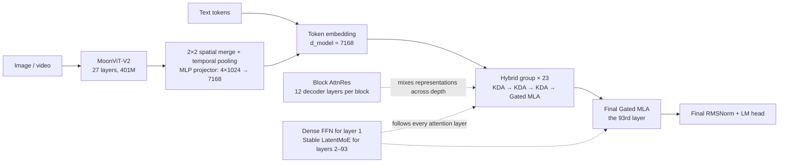
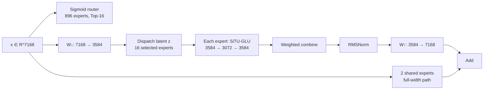

# Kimi K3 架构研究笔记：从 Token、Depth、Channel 三个维度扩展信息流

> 状态：基于 2026-07-29 可获得的官方技术报告、模型卡、公开配置与 Hugging Face 推理实现整理。
>
> 用途：这是供讲者备课和追溯实现细节的研究笔记，不是面向观众的主讲稿。面向分享的叙事版本见 [`../../architecture/kimi-k3.md`](../../architecture/kimi-k3.md) 与 [`../../architecture/kimi-k3-visualization/index.html`](../../architecture/kimi-k3-visualization/index.html)。

## 先给结论

Kimi K3 不是简单把 Kimi K2 的 MoE 参数量放大到 2.8T。它同时改了三条信息流：

1. **沿序列方向（token mixing）**：用 `3 × KDA + 1 × Gated MLA` 的混合注意力，把大多数长度增长的 KV cache 换成固定大小的递归状态，同时周期性保留全局 attention。
2. **沿网络深度（depth mixing）**：用 Block Attention Residuals 代替普通逐层残差累加，让每个子层按内容选择此前 block 的表示。
3. **沿模型宽度（channel mixing）**：用 Stable LatentMoE 把 routed expert 放到 3584 维 latent space 中，从而将 expert pool 扩到 896 个、每 token 激活 16 个。

此外，Kimi K3 从预训练开始就把 MoonViT-V2 接入同一个 backbone，成为原生图文/视频模型；在后训练阶段对 routed expert 进行 MXFP4/MXFP8 量化感知训练。

官方把 KDA、AttnRes、Stable LatentMoE、数据和训练 recipe 的**组合收益**概括为相对 Kimi K2 约 `2.5×` 的 scaling efficiency。这个数字不能归因给某一个模块。

## 1. 一张图看完整架构



更精确地写，93 个 decoder layer 的 attention 类型是：

```text
([KDA, KDA, KDA, Gated MLA] × 23) + [Gated MLA]
 = 69 KDA + 24 Gated MLA
```

最后额外放一个 Gated MLA，是为了保证 backbone 的最终一层一定做一次全局 token-to-token interaction。

每个 decoder layer 都仍然有两个主要子层：

```text
depth-mixed input
  → RMSNorm → KDA / Gated MLA
  → depth-mixed input
  → RMSNorm → Dense FFN / Stable LatentMoE
```

公开推理代码对 attention 子层和 FFN 子层分别使用一套 AttnRes pseudo-query，因此 AttnRes 不是只在每个 decoder layer 末尾执行一次。

## 2. 核心参数

| 项目 | Kimi K3 |
|---|---:|
| 总参数 | 2.78T（对外简称 2.8T） |
| 每 token 激活参数 | 104.2B（对外简称 104B） |
| Decoder layers | 93 |
| Backbone hidden size | 7168 |
| Attention composition | 69 KDA + 24 Gated MLA |
| Attention heads | 96 |
| Dense layers | 1 |
| MoE layers | 92 |
| Routed experts / layer | 896 |
| Selected routed experts / token | 16 |
| Shared experts / layer | 2 |
| Routed latent width | 3584 |
| Expert FFN intermediate width | 3072 |
| Activation | SiTU-GLU，`β₁=4, β₂=25` |
| Vocabulary | 163,840 |
| Maximum context | 1,048,576 tokens |
| Vision encoder | MoonViT-V2，27 layers，约 401M |
| Vision patch size | 14 × 14 |
| Post-training / deployment precision | MXFP4 routed-expert weights / MXFP8 routed-expert inputs |

“104.2B activated parameters”是模型级口径，不等于单卡驻留参数、一次 decode 实际从 HBM 读取的字节数，也不直接等于 FLOPs。做 Roofline 时必须回到具体 batch、并行切分、量化格式和 kernel。

## 3. K2 到 K3：真正发生了什么变化

| 维度 | Kimi K2 | Kimi K3 | 讲述重点 |
|---|---:|---:|---|
| 总参数 | 1.04T | 2.78T | 约 2.67× |
| 激活参数 | 32.6B | 104.2B | 约 3.2× |
| Layers | 61 | 93 | 深度增加 52% |
| Hidden size | 7168 | 7168 | backbone 宽度没变 |
| Attention heads | 64 | 96 | attention 内部并行度增加 |
| Attention | 61 MLA | 69 KDA + 24 MLA | 从全 MLA 改为 hybrid |
| Routed experts | 384 | 896 | expert pool 增大 2.33× |
| Active experts | 8 | 16 | 每 token 专家数翻倍 |
| Shared experts | 1 | 2 | 公共路径也增强 |
| Routed expert input width | 7168 | 3584 | routed path 压到半宽 latent |
| Expert intermediate width | 2048 | 3072 | 单 expert 更大 |
| Activation | SwiGLU | SiTU-GLU | 控制极值和低精度溢出 |
| Context | 128K | 1M | 8× |
| Vision | K2 本体无 ViT | 从预训练开始原生接入 | 不再做 post-hoc alignment |

最值得在分享里点出来的一条结构性观察是：

```text
K2 routed dispatch 的一阶 payload ∝ 8 × 7168 = 57,344 scalars / token
K3 routed dispatch 的一阶 payload ∝ 16 × 3584 = 57,344 scalars / token
```

也就是说，K3 用半宽 LatentMoE 把激活 expert 数从 8 提到 16，**理论上一阶 dispatch feature volume 没有随 top-k 翻倍**。这不代表端到端通信成本相同：K3 仍有更多 expert assignment、更复杂的调度、不同的并行拓扑和额外 latent projection。

## 4. Token mixing：为什么是 KDA + MLA

### 4.1 设计目标

标准 full attention 的历史状态随上下文长度线性增长。1M context 下，即使 MLA 已经压缩了 KV，全部 93 层都保留长度增长的 cache 仍然很昂贵。

Kimi K3 的取舍是：

- 69 个 KDA layer：历史被压缩进固定大小的递归状态，负责高效、位置敏感、偏重近期的 sequence mixing。
- 24 个 Gated MLA layer：保留不受递归状态容量限制的全局内容检索。
- 3:1 周期性交错：不是先放一段 KDA 再放一段 MLA，而是每四层做一次全局校正。

这可以理解成：

```text
KDA：便宜地“沿时间持续记忆”
MLA：周期性地“回看任意历史 token”
```

### 4.2 KDA 在做什么

对单个 attention head，KDA 保存一个矩阵状态：

$$
S_t \in \mathbb{R}^{d_k \times d_v}
$$

其核心更新为：

$$
S_t =
\left(I-\beta_t k_tk_t^\top\right)
\operatorname{Diag}(\alpha_t)S_{t-1}
+\beta_tk_tv_t^\top,
\qquad
\tilde{o}_t=S_t^\top q_t
$$

直观上可拆成三步：

1. `α_t` 对旧状态做逐 key-channel 衰减；
2. delta rule 根据当前 key 先擦除旧状态中冲突的方向；
3. `β_t` 控制把当前 `(key, value)` 写入多强。

如果 key 已归一化，也可以把它理解为：

$$
S_t = S'_t + \beta_t k_t(v_t^\top-k_t^\top S'_t),
\qquad
S'_t=\operatorname{Diag}(\alpha_t)S_{t-1}
$$

即只写入“当前 value 与已有记忆预测之间的误差”，而不是无条件叠加。

公开配置和实现中：

- KDA 使用 96 heads；
- 每个 head 的 `d_k=d_v=128`；
- Q/K/V projection 后先经过 kernel size 为 4 的 short convolution 和 Swish；
- Q/K 做 L2 normalization；
- `α` 是逐 head、逐 key-channel 的 forget gate；
- `β` 是逐 token、逐 head 的 write strength；
- 输出经过 head-wise RMSNorm 和输入相关的 full-rank sigmoid gate。

### 4.3 K3 对 KDA 的两个关键修改

#### Lower-bounded decay

Kimi Linear 原始形式的 log-decay 可以趋向负无穷。chunkwise 实现需要除以累计 decay，在有限精度下容易产生极大的 reciprocal，并迫使 diagonal tile 走逐 position-pair 的特殊路径。

K3 将 log-decay 改成：

$$
g_t = g_{\min}\operatorname{Sigmoid}(e^A z_t),
\qquad
\alpha_t=e^{g_t},
\qquad
g_{\min}=-5
$$

因此每步 retention 都满足：

$$
\alpha_{t,j} > e^{-5} \approx 6.7\times10^{-3}
$$

16-token tile 内累计 log-decay 被限制在 `(-80, 0)`，reciprocal 仍在 BF16 动态范围内。结果是 diagonal 和 off-diagonal causal tile 都能用 dense matrix multiplication，而不再需要主要由 position-pair 计算构成的 diagonal path。

这是一处很典型的 algorithm–hardware co-design：数学参数化的变化，直接消除了一个 kernel 特殊分支。

#### Full-rank output gate

K3 把 Kimi Linear 中的低秩 output gate 改成输入相关的 full-rank projection：

$$
y_t=W_o\left[
\operatorname{Sigmoid}(W_gx_t)
\odot
\operatorname{RMSNorm}(\tilde{o}_t)
\right]
$$

它让每个 token 能逐 channel 控制从 KDA 状态中读出多少信息。

### 4.4 Prefill 和 decode 的执行形态

KDA 同一个数学模块在两个阶段长得很不一样：

- **Training / prefill**：跨 chunk 递归，chunk 内并行。官方使用 FlashKDA，把 intra-chunk 计算和 cross-chunk state propagation 重叠。
- **Decode**：每步只更新一次 recurrent state，主要问题从“如何制造并行度”变成“如何低成本读取并原地更新状态”。

KDA 状态大小不随上下文长度增长，但并不等于状态很小。按公开形状计算，每个 KDA layer 的逻辑状态包含：

```text
96 × 128 × 128 = 1,572,864 scalars / sequence
```

如果只为建立量级直觉而假设 BF16、尚未做 tensor parallel sharding，则约为：

```text
3 MiB / KDA layer
69 layers ≈ 207 MiB / sequence
```

实际部署可能采用不同状态精度、head sharding、batch layout 和 checkpoint 策略，所以这个数字只能作为 Roofline/容量分析的起点，不能当成官方 serving footprint。

### 4.5 Gated MLA 保留了什么

MLA 把每个 token 的 K/V 内容压缩到低维 latent：

$$
c_t=W_cx_t
$$

推理时缓存 latent，再在 attention 计算中恢复各 head 的 content key/value。K3 的公开配置包括：

- `q_lora_rank = 1536`
- `kv_lora_rank = 512`
- 96 attention heads
- `qk_nope_head_dim = 128`
- `v_head_dim = 128`
- input-dependent full-rank output gate

K3 的 MLA 使用 **NoPE**。这里“NoPE”不等于模型不知道顺序：顺序和 recency 主要由相邻 KDA layer 的递归、decay 和 short convolution 编码；MLA 专注于全局 content interaction。这样扩展上下文时也不需要重新调整 RoPE base 或做 YaRN。

只有 24 个 MLA layer 保存随长度增长的 cache，69 个 KDA layer 使用固定 recurrent state。可以说长度相关 cache 的 layer 数降到约四分之一，但不要直接宣称“K3 的 KV cache 精确减少 75%”：`75% KV reduction / 6× decode throughput` 是 Kimi Linear 48B 实验结果，不是 K3 2.8T 的端到端实测结论。

## 5. Depth mixing：Attention Residuals

### 5.1 普通 residual 的限制

PreNorm Transformer 的普通 residual 会把此前所有层的输出以固定权重 1 不断相加：

```text
h_l = h_0 + f_1 + f_2 + ... + f_{l-1}
```

越深的网络越依赖一个被反复压缩和累加的单一状态。不同早期层的贡献会被混在一起，当前层不能按输入内容决定“应该重新读取哪个深度的表示”。

### 5.2 Full AttnRes

AttnRes 给每个子层一个可学习 pseudo-query `w_l`，对 embedding 和此前层输出做一次沿 depth 维度的 softmax：

$$
\alpha_{i\rightarrow l} =
\frac{
\exp(w_l^\top\operatorname{RMSNorm}(v_i))
}{
\sum_{j<l}\exp(w_l^\top\operatorname{RMSNorm}(v_j))
},
\qquad
h_l=\sum_{i<l}\alpha_{i\rightarrow l}v_i
$$

虽然 query 本身是每层固定的学习参数，但 key/value 来自当前 token 在不同深度的表示，因此权重仍然是**按 token、按内容变化**的。

### 5.3 K3 使用 Block AttnRes

Full AttnRes 需要保留所有层输出，memory/communication 为 `O(Ld)`。K3 使用 block 版本：

- decoder layers 按 12 层分组；
- 前 7 个 block 各 12 层，最后一个 partial block 9 层；
- 连同 embedding source，一共有 9 个 depth source；
- block 内仍用普通 partial sum；
- 跨 block 才做 depth attention。

因为一个完整 hybrid attention 周期是 4 层，所以一个 12-layer AttnRes block 正好包含：

```text
3 × [KDA, KDA, KDA, Gated MLA]
```

Block AttnRes 把需要长期保留的表示从 `O(Ld)` 降为 `O(Nd)`。公开实现还显示：

- attention 子层和 FFN/MoE 子层各有自己的 pseudo-query projection；
- 每到 12-layer boundary，把当前 partial sum 固化为一个 block representation；
- backbone 末尾再对所有 block representation 做一次 output AttnRes。

对性能分析而言，AttnRes 的算术量不大，主要代价通常是读取多个 block representation、在线 softmax 和 depth reduction，因此更应关注 memory traffic、fusion 和与 collective 的重叠。

## 6. Channel mixing：Stable LatentMoE

### 6.1 一条 token 的完整 routed path



可以写成：

$$
z=W_\downarrow x
$$

$$
u=\sum_{i\in T_{16}(x)}p_iE_i^{\text{routed}}(z)
$$

$$
y=
\sum_{j=1}^{2}E_j^{\text{shared}}(x)
+
W_\uparrow\operatorname{RMSNorm}(u)
$$

router 在完整 7168 维输入上打分；只有 routed expert 的输入被压到 3584 维。两个 shared expert 仍处理 full-width 输入，用来承担常见、无需稀疏专门化的变换。

### 6.2 为什么叫 Stable

“Stable LatentMoE”至少包含下面四层含义，不能只解释成 latent projection：

#### 1. Latent routed space

将 routed path 从 `d=7168` 压到 `ℓ=3584`。`W↓` 在 dispatch 前执行，`W↑` 在 combine 后执行，因此 top-k 增大时，跨设备搬运的是半宽 latent feature。

#### 2. Normalized LatentMoE

16 个 expert 的加权输出聚合后先做 RMSNorm，再通过 `W↑` 返回 full width。它降低不同 expert 组合和 routing weight 引起的尺度波动，避免 routed branch 与 shared branch 相加时数值不稳定。

#### 3. SiTU-GLU

SwiGLU 的 gate 和 up 两个乘法分支都无界，在 2.8T 规模和低精度训练下容易产生 activation outlier。K3 定义：

$$
\operatorname{softcap}(x,\beta)=\beta\tanh(x/\beta)
$$

$$
\operatorname{SiTU\text{-}GLU}(x)=
\left[
\beta_1\tanh\left(\frac{W_gx}{\beta_1}\right)
\odot \operatorname{Sigmoid}(W_gx)
\right]
\odot
\left[
\beta_2\tanh\left(\frac{W_ux}{\beta_2}\right)
\right]
$$

其中 `β₁=4, β₂=25`。它在原点附近保留类似 SwiGLU 的形状，但把单坐标乘积绝对值限制在 `β₁β₂=100` 附近。

#### 4. Quantile Balancing

router 先计算：

$$
s_{i,j}=\operatorname{Sigmoid}(W_rx_i)_j
$$

训练时，用 expert-specific bias `b_j` 只修正 Top-k selection：

$$
T_i=\operatorname{TopK}(s_i+b,16)
$$

真正的 mixture weight 仍来自未加 bias 的 `s`，并在选中的 16 个 expert 内归一化。因此 balancing bias 改变“送到谁”，不直接改变“选中后混多少”，也不通过梯度替代 router 学习。

Quantile Balancing 使用 Top-(k+1) 的 cutoff，为每个 expert 估计能达到目标 token load 的 score quantile。大规模训练中不收集全部 margin，而是对每个 expert 建 histogram，再做一次 global all-reduce。训练结束后 bias 冻结，推理不再在线更新。

### 6.3 参数量为什么能到 2.8T

按公开矩阵形状估算，一个 routed expert 的权重为：

```text
3 × 3584 × 3072 = 33,030,144 ≈ 33.0M parameters
```

一个 MoE layer 的 896 个 routed experts 合计：

```text
896 × 33.0M ≈ 29.6B parameters
```

92 个 MoE layer 中，仅 routed experts 就约为：

```text
92 × 29.6B ≈ 2.72T parameters
```

再加 routed latent projection、router、shared experts、attention、embedding 等，得到官方的约 2.78T。

单 token 在一个 MoE layer 只激活 16 个 routed experts：

```text
16 × 33.0M ≈ 528.5M routed-expert parameters
```

这个计算有助于解释“总参数非常大、每 token 只走稀疏子图”，但不能用它替代官方 104.2B activated-parameter 口径；后者还包含 92 层累积的 attention、shared path、latent projection、dense layer 等组件。

### 6.4 对后续 MoE 优化章节的直接启示

- **Prefill**：token 数多，每个 expert 更容易形成较大的 grouped GEMM，主要看 expert compute、all-to-all 吞吐和 overlap。
- **Decode**：单步 token 少、896 个 expert 导致 token 分布碎片化，grouped GEMM 更容易退化成 weight streaming，偏 memory-bound。
- **Top-16**：每 token 产生 16 个 assignment，调度和 combine 开销不能忽略。
- **Latent width 3584**：降低 dispatch/combine feature bytes，但增加 `W↓/W↑` 两个 dense GEMM；是否划算取决于能否 fusion 和 overlap。
- **MXFP4 expert weights**：显著降低 routed expert 的权重读取字节数，但硬件是否原生支持相应格式、反量化是否融合，会决定实际收益。
- **Shared experts**：与 routed dispatch 独立，可与通信或 latent projection overlap。

官方 GPU serving 实现明确把小 batch routed-expert GEMM 描述为 memory-bound，并采用 token-centric kernel。把这一结论迁移到 TPU 前，需要重新用 TPU 的矩阵单元、HBM 带宽、collective 和量化支持做 Roofline 验证。

## 7. Native Vision：不是后接一个视觉插件

Kimi K3 的多模态路径是：

```text
image / video
  → 14×14 patch embedding
  → MoonViT-V2 (27 layers, hidden 1024, 12 heads, FFN 4096)
  → 2×2 spatial merge + temporal pooling
  → lightweight MLP projector
  → 7168-d visual embeddings
  → 与 text embeddings 放入同一 token stream
  → shared KDA/MLA/MoE backbone
```

关键点：

- MoonViT-V2 约 401M 参数；
- vision encoder 从随机初始化开始，直接使用 next-token prediction 联合训练；
- 不使用先做 contrastive pretraining、再与 LLM 对齐的 post-hoc 路线；
- image 和 video 共享 encoder 参数；
- 2×2 spatial merge 把视觉 token 数减少 4 倍；
- 技术报告称可处理最高约 `3584 × 3584` 的图像；
- visual token 与 text token 进入同一个 1M context。

官方 README 的 summary 表写的是 `Text, Image`，技术报告和处理代码则明确包含 video pathway。讲课时可表述为“架构和训练支持图像/视频；公开部署接口与不同 serving engine 的具体 video 支持需另行核对”。

## 8. 训练与部署相关、但不应混进 backbone 主图的部分

### Progressive context extension

K3 不是从头到尾都用 1M sequence 训练：

```text
pre-training: 8K → 64K
cooldown:    256K → 1M
```

NoPE 让 context extension 不需要修改 positional encoding，但长上下文能力仍依赖 progressive curriculum 和专门构造的长文档、多模态、跨位置检索数据。

### Quantization-aware post-training

技术报告给出的准确范围是：

- routed MoE expert weights：MXFP4；
- routed expert input activations：MXFP8；
- attention projection、latent MoE projection、shared experts、router、vision tower、LM head 等保持更高精度；
- QAT 从 SFT 开始，贯穿后续 RL。

因此不要把它简化成“整个 Kimi K3 都是 FP4”。

### MTP / EAGLE-3 draft model

技术报告称预训练时包含一个结构类似 backbone block 的 MTP layer，后续将其微调成 EAGLE-3 风格的 draft model，用于 lossless speculative decoding。它融合第 1、第 4 和最后一个 AttnRes block 的特征。

公开发布的主模型 `config.json` 中 `num_nextn_predict_layers` 为 0，因此讲 backbone 的 93 层时不应把 draft layer 画进去。除非后续找到单独发布的 draft checkpoint，否则把它放在 serving appendix 更稳妥。

### MoonEP

MoonEP 是 K3 训练基础设施，不是模型数学架构。它通过动态 redundant expert 让每个 EP rank 精确接收 `S×K` 个 token，获得 static shapes、zero-copy dispatch/combine 和负载平衡。

它当前公开实现面向 NVIDIA GPU；不能直接当成 TPU 上已有的实现方案，但其中“负载平衡、静态 shape、通信与 shared expert overlap”的问题定义对 TPU 同样适用。

## 9. 建议的 7 页讲述顺序

### Slide 1：一句话定位

标题：**Kimi K3 = 在 token、depth、channel 三个方向同时扩展信息流**

只放四个数字：

```text
2.78T total / 104.2B active / 93 layers / 1M context
```

### Slide 2：K2 → K3

只保留四组变化：

```text
61 MLA → 69 KDA + 24 MLA
384 choose 8 → 896 choose 16
standard residual → Block AttnRes
128K → 1M + native vision
```

### Slide 3：完整 block 图

画：

```text
[KDA + MoE] × 3 → [Gated MLA + MoE]
```

说明重复 23 次，末尾再加 1 个 MLA；第 1 层 dense，后 92 层 MoE。

### Slide 4：KDA 为什么能服务 1M context

左边画 full attention 的长度增长 KV，右边画 KDA 固定 recurrent state。

强调两句话：

1. KDA 不是 free：它用固定但较大的矩阵 state 换掉长度增长 cache。
2. 每四层的 MLA 保留全局检索能力。

### Slide 5：AttnRes

对比：

```text
普通 residual：所有旧层固定权重相加
AttnRes：当前 token 对此前 depth source 做 softmax
```

说明 K3 用 12-layer block 版本控制 memory/communication。

### Slide 6：Stable LatentMoE

只画两条支路：

```text
full-width shared path
half-width routed path: 7168 → 3584 → 16/896 experts → 7168
```

重点讲 `8×7168 = 16×3584`，自然接到后面的 MoE 优化章节。

### Slide 7：给硬件分析留下问题

列出三个问题：

1. KDA recurrent state 在 prefill/decode 分别是 compute、state traffic 还是 launch bound？
2. Top-16 LatentMoE 在 TPU 上的 dispatch、grouped GEMM、combine 如何映射？
3. MXFP4/MXFP8 若没有等价原生路径，真实 memory roofline 怎么重算？

## 10. 容易讲错的地方

1. **错：** K3 是 93 层 KDA。

   **对：** 69 KDA + 24 Gated MLA。

2. **错：** 每四层为一组，所以正好有 23.25 个相同 block。

   **对：** 23 个 `3 KDA + 1 MLA`，最后额外一个 MLA。

3. **错：** NoPE 意味着没有位置信息。

   **对：** KDA 的 causal recurrence、decay 和 short convolution 隐式编码顺序；MLA 本身不加显式 position encoding。

4. **错：** 896 选 16 导致通信量相对 K2 必然翻倍。

   **对：** routed width 从 7168 降到 3584，一阶 feature payload 恰好抵消 top-k 翻倍；assignment 和调度开销仍增加。

5. **错：** 2.5× scaling efficiency 是 KDA 单项收益。

   **对：** 官方明确归因于架构、数据和训练 recipe 的组合。

6. **错：** K3 已证明端到端 KV cache 减少 75%、decode 快 6×。

   **对：** 这些数字来自较小的 Kimi Linear 48B 实验，不能直接搬到 2.8T K3。

7. **错：** 整个模型都是 MXFP4。

   **对：** 主要是 routed expert weights；non-expert modules 保持更高精度。

8. **错：** 104.2B active 就是每步需要从 HBM 读 104.2B 个参数。

   **对：** 还受 cache、并行切分、batch reuse、量化、fusion 和 kernel layout 影响。

9. **错：** MoonEP 是 Stable LatentMoE 的一部分。

   **对：** 前者是训练系统，后者是模型模块。

## 11. 目前仍需在 TPU / SGLang-JAX 上确认

- KDA state 的实际 dtype、sharding、layout 和每 request footprint；
- KDA chunk size、tile size，以及 lower-bounded decay 在 TPU kernel 中的映射；
- 24 层 MLA 的生产 cache layout 和每 token 实际字节数；
- 896 experts 在目标 TPU slice 上如何做 expert placement；
- Top-16 dispatch 的 collective pattern、padding 和负载偏斜；
- `W↓ + router`、`W↑ + combine`、shared expert 与通信能否 fusion/overlap；
- SiTU-GLU 和 MXFP4/MXFP8 是否存在原生、数值一致的 TPU 实现；
- Block AttnRes 的 block representation 是否驻留 HBM，以及 prefill/decode 的读流量；
- released 104.2B activated-parameter 口径与具体 serving graph 的逐层核对；
- MTP/EAGLE-3 draft checkpoint 是否公开及目标 serving engine 是否支持。

这些问题应进入后续 Roofline 和 MoE 优化章节，不应在架构分享里提前写成性能结论。

## 12. 主要依据

- [Kimi K3 Technical Report](https://github.com/MoonshotAI/Kimi-K3/raw/main/k3_tech_report.pdf)：架构 §2（pp. 3–10）、K2/K3 对比 Table 1（p. 11）、系统 §5（pp. 17–25）。
- [Kimi K3 official repository](https://github.com/MoonshotAI/Kimi-K3)：官方 model summary 与发布说明。
- [Kimi K3 Hugging Face config](https://huggingface.co/moonshotai/Kimi-K3/blob/main/config.json)：公开 checkpoint 的精确层号、维度、expert 与 vision 配置。
- [Kimi K3 text implementation](https://huggingface.co/moonshotai/Kimi-K3/blob/main/modeling_kimi_linear.py)：KDA、Gated MLA、Stable LatentMoE、Block AttnRes 推理路径。
- [Kimi K3 multimodal implementation](https://huggingface.co/moonshotai/Kimi-K3/blob/main/modeling_kimi_k3.py)：MoonViT-V2、patch merge、projector 与 visual embedding 合并路径。
- [Kimi Linear paper](https://arxiv.org/abs/2510.26692)：KDA 和 3:1 hybrid attention 的前置研究。
- [Attention Residuals paper](https://arxiv.org/abs/2603.15031)：Full/Block AttnRes 的定义与 scaling 实验。
- [LatentMoE paper](https://arxiv.org/abs/2601.18089)：latent routed-expert design 的来源。
- [MoonEP repository](https://github.com/MoonshotAI/MoonEP)：K3 expert-parallel training infrastructure。

更完整的资料优先级、图表页码和使用注意事项见 [`README.md`](README.md)。
